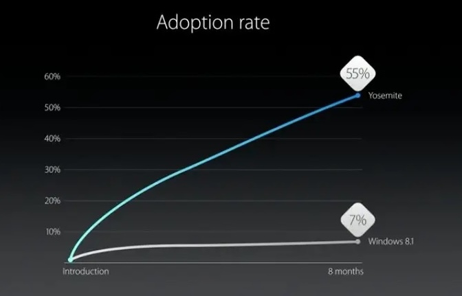
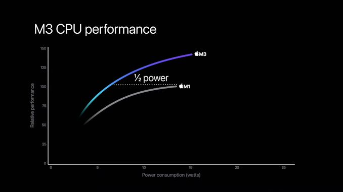

Learning from my product peers, TIL if you’re making an impactful change then it’s always good to be able to have logs / metrics / dashboards that help you quantify the impact from the perspective of: 
- Users
- Engineers
- Product Managers
- Company

Example if your change causes less errors (or more users down a funnel), then:
1. Previously 2000 users a day were seeing errors, now only 600 see the error. Less chatting with the AI chat box. 
2. Are going from 5 triage calls (5 engineers each involved for 2hrs for each triage) a month down to 3 triage calls a month?
3. The success rate of our flow has increased by +1400 a day which means 5% more success rate. 
4. The financial impact of 1400 more users is is worth 1400 * $5 per day, also we're now having 1400 less chat box interactions which is reduces load on our servers.

If you didn’t figure out a way or haven’t spent time in capturing the metrics then don’t release it. Otherwise your change isn’t measured / celebrated / understood / shared / marketed / rewarded.

Deferring the dev work to add logs to a future release **will work against you** if you can’t store all the data or don’t have metrics *before* the change. This requires you to have proper process and understanding set up with your Manager and Product Manager so that you don't rush to release.

It’s possible that your change can have an unexpected negative impact. You won’t know of it unless you have metrics / alerts / baselines in place.

## Note
The 2nd step often requires you to find/reach out the right (product) person and have them help you figure the $ value for it.  
The more the change impacts the users, the more you have to get Product involved to help you come up with that business / product impact.

## Examples

Apple Product Launches do a great job at highlighting the user/product impact

## Summary 

Upon sharing my realization with my team members as a common shortcoming of us engineers, one of our company's most distinguished engineers immediately replied with: 

> Excellent Advice. Every time I’ve been promoted at our company, it’s because I had data like this to quantify my business impact, and I made sure to collect it every time I shipped something so I had an inventory of impact to reference.

As someone who's recently became a tech lead, it took me a while to understand, regardless of my engineering abilities, I lack significantly in the domain of office skills such as metrics gathering and showing impact. Since realizing that, I've been accounting time for how to log the diff, not to rush releases, and most of all, the time that I have to spend (or delegate to a PM or Manager) to find a reasonable dollar value to be calculated.

