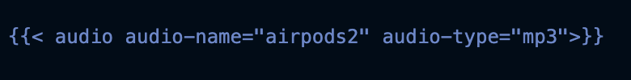
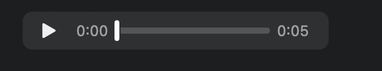

## Frontmatter
There are some standard Hugo frontmatter, but there's also a lot of theme-specific frontmatter. In this post I might be referring to theme-specific frontmatter that you won't find in another theme. But the general idea of frontmatters is universal.

  - You can add `tags: [swift, json, network call]` and it will then add the tags to your post. 
  - Add `showToc: true` and will show a table of contents for your post.
  - Hugo automatically takes the first 70 words of your content as its summary and stores it into the `.Summary` variable
  - The `date` of the field affects the order of the post. So if you drafted the markdown of your file 2yrs ago, but published it today, then make sure you adjust the date. Otherwise it will be burried under the newer posts. 
    - Instead, you can manually define where the summary ends with a  "!--more--" (Notes: must be wrapped inside angle brackets) divider. 
    - Alternatively, you can add a `summary` to the front matter if you don’t want your summary to be the beginning of your post
- Customize `Description`. The value of this field is used as an abstract in your front page and link previews.
- Add two spaces to create new line after a line end. Otherwise hugo will just continue the line. This is something hard to grasp. Because of this I usually manually review my rendered post with `hugo server -D`

## Syntax Formatting

- Highlighting individual code lines. Example:

```swift { hl_lines=["2-3"]} 
class Foo {
    var name = "Jack"
}

```

or I can add line numbers:

```bash {linenos=true linenostart=1}
rvm use ruby-2.5.1 || rvm install ruby-2.5.1
gem install bundler -v "2.3.3" 
bundle install
pod lib lint
```

## Resource management

- With images, overtime your static folder will turn into a big graveyard. So it's best that you re-structure your posts. Example:
```
   - Bad way:
        - Posts
            - post1
            - post2
        - static
            - imageA
            - imageB
    - Good way:
      - Posts
            - post1
                - index.md
                - images
                    - imageA
            - post2
                - index.md
                - images
                    - imageB
```
- _context-aware_ is the more technical term that implies that `.Title` has a different meaning for each post or at the global level vs post level. At the post level, `.Title` is the title of the post. At the global level, `.Title` is the title of the website. See [here](https://youtu.be/w6_cQsTwd3Q?t=412) for more.
- Have expandable section. You can default it to open. See [here](https://gist.github.com/pierrejoubert73/902cc94d79424356a8d20be2b382e1ab). Example:

```
<details>
  <summary>See answer</summary>
  - in-order traversal for all will be: `[1,2,3,4]`
  - level-order would be different for each. 
</details>
```
## Making changes to your theme

If you ever needed to make changes to your shortcodes, then you have to: 
1. Fork the theme
2. Change directory to your theme's repo. This is a subdirectory from the main repo that uses your theme. 
3. Make changes locally to the theme. 
4. Push the commit to your fork.
5. Change directory to your website's directory. Then if you do a `git diff` you'd see a change in the SHA of your submodule. Commit the SHA. Like just do `git add` adn then `git commit`.
6. Then once you push to Netlify, Netlify will checkout the correct commit using the SHA of the submodule.

## Shortcodes

It's a way for you to do custom HTML within markdown. Think of writing the html cusomization in shortcode. Then naming that customization. Then invoking it in markdown. Example see here:

### Usage of shortcode



### Shortcode definition

```
<audio controls>
  <source src="/{{.Get "audio-name"}}.{{.Get "audio-type"}}" type="audio/{{.Get "audio-type"}}"> Your browser does
  not support the audio element.
</audio>
```

### Shortcode visualization

