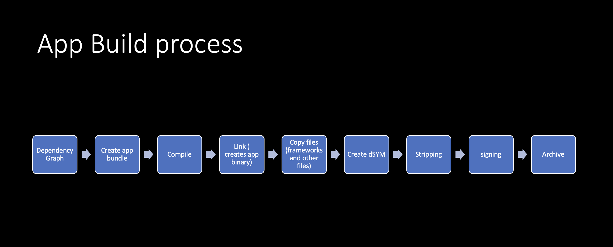

This the first post of a series I'm doing on how to optimize your app's binaries. The post is more of a high level intro. 

Depending on the action (build, run, test, profile, analyze, archive) of your scheme, the  process will have all or some of the following steps:
1. Dependency analysis
> What happens when you press build? So the first step is for the build system to take the build description, your Xcode project file. Parse it, take into account all the files in your project, your targets and the dependency relationships. Your build settings, and turn it into a tree-like structure called a directed graph. And this represents all the dependencies between the input and output files in your project and the tasks that will be executed to process them. Next the low-level execution engine processes this graph, looks at the dependency specifications and figures out which tasks to execute. The sequence or order in which they must be run and which tasks can be run in parallel. Then proceeds to execute them.
From [WWDC 2018 - Behind the Scenes of the Xcode Build Process 4:57](https://developer.apple.com/videos/play/wwdc2018/415/?time=297)
2. Compile dependencies
- Parse all files (swift, .m, .c, .cpp files) in module. 
- Create object (intermediate) files  that the CPU can understand. 
- Each file is compiled individually
- The reason you need this step is because CPU does doesn't understand swift (or python, go, ruby, etc.) The compilation creates an intermediate file that makes it easier for the CPU to understand your swift code...
3. Link all object (intermediate) files 
- Link all the intermediate files and create a binary
- Each dependency/module/framework/library needs to get built. So if you have 20 dependencies. Then you'll end up linking and creating 20 libraries (If those dependencies have some other dependencies, then those need to get compiled and linked as well). You'd also have one app binary linked as well. So you have to link a minimum of 21 times.
4. Copy resources and all binaries
- Each framework that's dynamically† linked will have to get copied into the app bundle. If you have 20 dependencies, then 20 frameworks need to get copied over into the app bundle. 
- Xcode creates the [`.app` bundle wrapper](http://mfaani.com/posts/devtools/whats-the-difference-between-an-app-bundle-and-a-binary/). Then copies the dynamically linked frameworks over into your .app bundle. The copying is necessary because Xcode pulls the frameworks in a two step process: 
    1. All frameworks get created in the _build_ directory.
    2. Frameworks get copied into the final linked product.
It's like laying stuff on the floor, then copying each item into your backpack. Your backpack is the final linked product. 
5. Post Processing
    - Generating dSYMs. 
    - Stripping symbols (from each binary).
    - Code-signing
6. Archiving 
 - Compresses/archives the Product
 - Places the dSYMs in the archive. The dSYMs were already generated during the compilation step. 
7. Distribution. However distribution isn't part of the build or archive actions. It's usually a step that you'd follow afterwards. 

**Note:** 
Depending on the action: 
- Some steps may be included or excluded. 
    Example: Archiving and distribution don't happen for debug builds. Also dSYMs aren't generated unless you change the default settings. 
- Some steps get processed differently.
    Example: DWARF is generated for debug builds. DWARF with dSYM is generated for archiving steps. Because Archiving steps is configured to use your 'Release' configuration. 

**Pro tip:** If you're ever uncertain about the default value of a flag then just create a dummy new project/framework and test things out. This is because most of the time the default setting is the best choice. 

†: Static libraries, don't have a separate binary in the final app bundle. Their code and symbols just get absorbed into app's main binary. More on that later. 

For the most part the flow is like this: 

References: 
[Behind the Scenes of the Xcode Build Process](https://developer.apple.com/videos/play/wwdc2018/415/)

The series will include:
- Start with a small example on how to compile a single Swift file. Some detailed jargon.
- The difference of static vs. dynamic library and their impact on App Size. What's the difference between Compilation and Linking? 
- Where/how the Xcode Build Settings affect the compilation of things. Compiling source code vs. using pre-compiled binaries. 
- Discuss an .app bundle anatomy and how to inspect the bundle and its binaries and get an app store thinning report. 
- How to inspect a binary. How are symbols baked into the app. 
- The stripping flags Apple has and what they each do and their affect on app size and dSYM.
- Pivot into CocoaPods and its _faulty_ stripping behavior as well. 