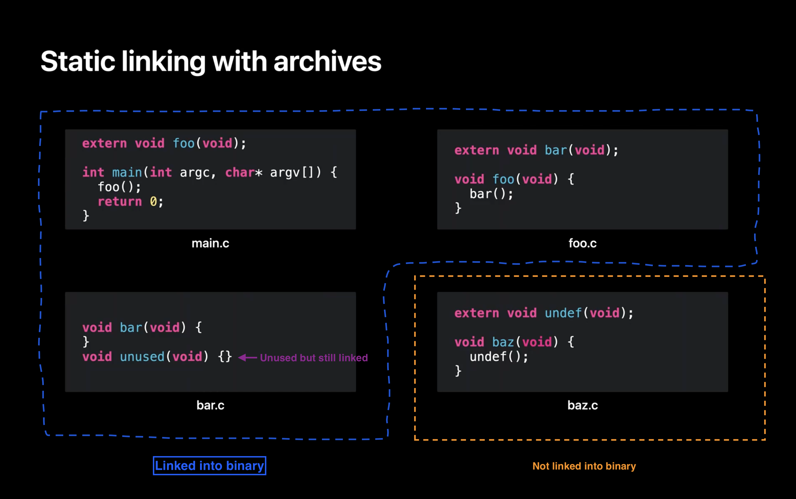

In the [previous post](https://mfaani.com/posts/devtools/optimizing-app-size/jargon/#a-big-final-program) we talked about a problem with the linker: Linking a single function from a library could link to the _entire_ library. This creates a lot of bloat. 
As a result some enhancements were made to linker. The enhancement was to be selective and only load symbols that you need.

Inspired by [Link fast: Improve build and launch times - 4:15](https://developer.apple.com/videos/play/wwdc2022/110362/?time=255):

## Selective Loading

In a nutshell if you have the following source code written in C:

`extern` means that the function is coming from an external file.

### File Structure

As you can see above, some functions depend on other functions: 

- In main.c, there's a function called main that calls a function foo. 
- In foo.c, there is foo which calls bar. In bar.c, there is the implementation of bar but also an implementation of another function which happens to be unused. 
- Lastly, in baz.c, there is a function baz which calls a function named undef. 

Now we compile each to its own [.o file](https://mfaani.com/posts/devtools/optimizing-app-size/jargon/#files). 

- foo, bar, and undef are undefined [They're marked with `extern` i.e. they're not defined within the file that attempts to use them]. That is, a use of a symbol and not a definition. 

Now, let's say you decide to combine bar.o and baz.o into a static library. Next, you link the two .o files and the static library. Let's step through what actually happens.

### How linker works
First, the linker works through the files in command line order. The first it finds is main.o. It loads main.o and finds a definition for "main", shown here in the symbol table. But also finds that main has an undefined "foo". 

- main is defined in main.o because we have its implementation and definition. 
- foo is undefined, because we don't have its definition nor its implementation. We only know that it's external

The linker then parses the next file on the command line which is foo.o. This file adds a definition of "foo". That means foo is no longer undefined. But loading foo.o also adds a new undefined symbol for "bar". 

Now that all the .o files on the command line have been loaded, the linker checks if there are any remaining undefined symbols. In this case "bar" remains undefined, so the linker starts looking at libraries on the command line to see if a library will satisfy that missing undefined symbol "bar". 

The linker finds that bar.o in the static library defines the symbol "bar". So the linker loads bar.o out of the archive. 

At that point there are no longer any undefined symbols, so the linker stops processing libraries. 

The linker moves on to its next phase, and assigns addresses to all the functions and data that will be in the program. Then it copies all the functions and data to the output file. Et voila! You have your output program.

### Summary of Static Library

You only include object files that you link against. If you don't link against them, then they don't get included in the final binary.

With that said, the level of control for selecting source code is not the 'type level' nor 'function level'. It's at the 'file level'. This was demonstrated in the example above where `unused` function is linked into the final binary, while the entire baz object file is excluded.
## Let's answer some common Linker questions:

### When does the linker finish linking object files?
As soon as they're no longer any undefined symbols. The linker is much like fixing a puzzle. You start with a piece, its edges need other pieces to complete. You keep on adding more pieces. You stop when the last piece is added. Anything remaining is redundant.

### How are the compiler and linker different? 
See my previous post on [Optimzing App Size - Jargon#Concepts](http://localhost:1313/posts/devtools/optimizing-app-size/jargon/#concepts). It explains things at the high level.  

The compiler needs to know what the other symbols are in order to compile code that uses them.  
The linker combines these object code files into an executable. The linker needs to know where the other symbols are in order to link code objects that use them.

FWIW many IDEs invoke them in succession, so you never actually see the linker at work. Some languages/compilers do not have a distinct linker and linking is done by the compiler as part of its work. 

With Xcode you use:
 - `swiftc` which ends up calling `swift-frontend` to compile Swift files
 - `clang` to compile C family of code. 
 - `ld` or `clang` to link object files. 

A bit more about the Linker:
> It's one of the final processes in the build. And what we do is we combine all of these .o files that have been built by the two compilers (clang and swift) into an executable.
> All it does is move and patch code. It cannot create [object] code, and this is important and I will show that in the example. 
> But we take these two kinds of input files. The first one being object files. Which are what come out of your build process. And the second one being libraries which consist of several types including dylibs, [tbd's](https://developer.apple.com/videos/play/wwdc2018/415/?time=2858), and .a files (or static archives).
>
> from [WWDC 2018 - Behind The Scenes of Xcode Build Process](https://developer.apple.com/videos/play/wwdc2018/415/?time=2673)

Also See [Compiling and Linking - Alex Allain](https://www.cprogramming.com/compilingandlinking.html)
#### Which tool generates the binary?
The compiler doesn't generate an executable.  
The linker does that. 

#### Is compilation and Linking done in parallel? 
Compilation is done in parallel.  
Linking is done serially — after all compilation is done. 

#### What's the input/output of each?
The input of the compiler is source code. Its output are object files.
The input of the linker are object files. Its output is some binary (dylib or an app binary).
Compiler will compile every piece of source code. 
The Linker will only link object files that are needed. If a certain object file / symbol isn't needed then it won't get linked. 

#### Does Compilation take more time or linking?
Usually compilation takes a lot more time, because there's a lot of static analysis that your compiler needs to do to validate everything. And while developers don't care if their build time took a couple seconds long,  users certainly care significantly if the app launch took a few seconds. This is why finding the right balance between the right amount dynamic and static libraries is critical. Apple recommends you try things out both ways and then profile things to make sure you're making the best decision. 

### How do you access symbols from another file?
Different languages have different ways of doing things. The different options are:

- Declare a [header file](https://mfaani.com/posts/devtools/optimizing-app-size/jargon/#files). Include the header file where needed.
- Use `extern` to mark a symbol as external to the current file. It will get resolved at link time. Swift doesn't use `extern`
- Use a library and import everything within it.
- Have a language construct along with certain build tools that understand how your code is to be packaged as a module. That is why you don't need to include a header, or mark as extern. The compiler just knows that foo, bar, baz are all part of the same module. Hence have access to the _internal_ symbols. This is how Swift works. You don't need to import/include the header file of another file in your same module. 

## Any Problems with Static Linking? 

Yes there are a few. Mainly when it comes to sharing libraries between an app and its app extensions. For more on that see [part 2](https://mfaani.com/posts/devtools/optimizing-app-size/how-does-the-linker-help-reduce-app-size-part-2/) of this post. 
