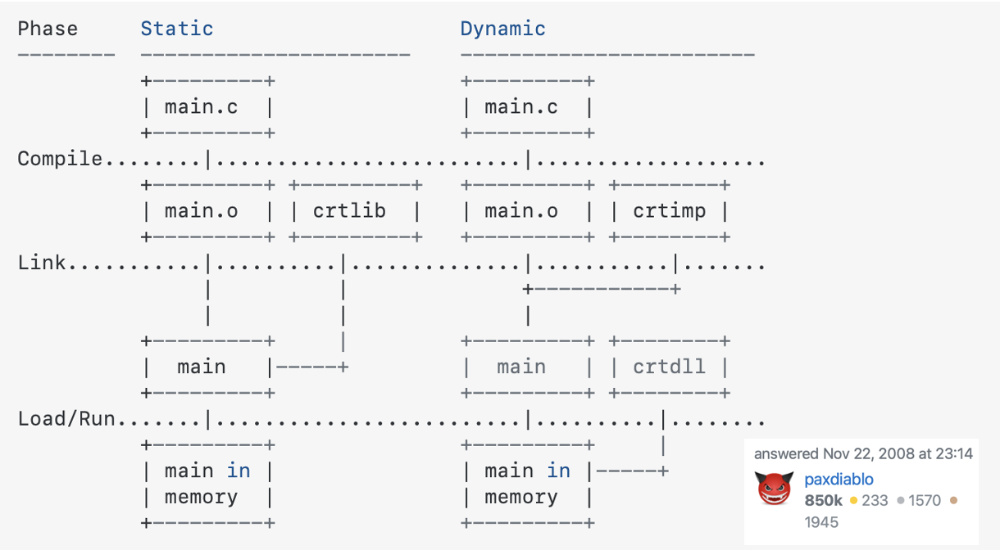
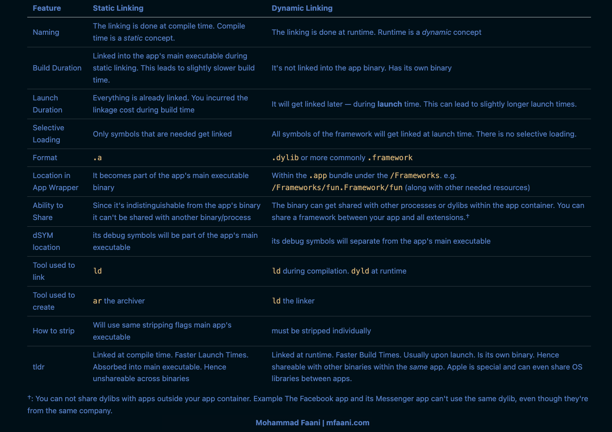

In the [previous post](https://mfaani.com/posts/devtools/optimizing-app-size/jargon/#a-big-final-program) we talked about how the linker's selective loading helps solve the bloat issue. But there are some other limitations to static linking. Because of those limitations software engineers created Dynamic libraries and the Dynamic Linker. In this post we'll go through some of those limitations and discuss the trade-offs between the two ways of linking and their sizing impact.

Inspired by [Link fast: Improve build and launch times - 15:47](https://developer.apple.com/videos/play/wwdc2022/110362/?time=947):

## 'Selective Loading' resolves the bloat issue. Are there any other issues with Static Linking? Why do we need dynamic linking?

Think about how will adding libraries scale over time, as there is more and more source code. It should be clear that as more and more libraries are made available, the end program may grow in size. That means the static link time to build that program will also increase over time.

What if we switched from using 'ar' to 'ld'? As a result the output of library is now an executable binary. This was the start of dynamic libraries in the '90s. As a shorthand, we call dynamic libraries "dylibs". On other platforms they are known as DSOs or DLLs. 

So what exactly is going on here? And how does that help the scalability? 

**The key is that the static linker treats linking with a dynamic library differently. Instead of copying code out of the library into the final program, the linker just records a kind of _promise_**. 

That is, it records the symbol name used from the dynamic library and what the library's path will be at runtime. How is this an advantage? 

1. It means **your program file size† is under your control**. It just contains your code, and a _list_ of dynamic libraries it needs at runtime. You no longer get copies of library code in your program. Your program's static link time is now proportional to the size of _your code_, and independent of the number of dylibs you link with. 

2. Also, the Virtual Memory system can now shine. When it sees the same dynamic library used in multiple processes, the Virtual Memory system will re-use the same physical pages of RAM for that dylib in all processes that use that dylib. 

3. Using dynamic libraries speed up _build time_. 

4. You can share libraries with your other app extensions. 

Let's assume you have: 
- app code that without linking to another library has a size of 20MB
- appex (app extension) that without linking to another library has a size of 7MB

And both need to link to a static library named Foo. Assume Foo library is 5MB. Also assume both need all symbols in Foo library i.e. all symbols of Foo library will get linked. 

In this scenario, your total app size is increased 5Mb when Foo library is statically linked into app's main binary. And also increased another 5Bm when Foo library is statically linked into the appex binary. 

If Foo library was instead linked dynamically with both, then both it would increase the app size by only 5Mb, because the library can be shared. 

I've shown you how dynamic libraries started and what problem they solve. But what are the "costs" for those "benefits"?

1. Launching your app is now slower. This is because launching is no longer just loading one program file. Now all the dylibs also need to be loaded and connected together. In other words, you just _deferred_ some of the linking costs from _build_ time to _launch_ time. 

2. A dynamic library based program will have more dirty pages. In the static library case, the linker would co-locate all globals from all static libraries into the same DATA pages in the main executable. But with dylibs, each library has its DATA page. 

3. Dynamic linking is that it introduces the need for something new: a dynamic linker! Remember that promise that was recorded in the executable at build time? Now we need something at runtime that will fulfill that promise to load our library. That's what `dyld`, the **dynamic linker**, is for.

†: Program file size does not mean the 'app size'. It means the [main app executable](https://mfaani.com/posts/devtools/optimizing-app-size/jargon/#files) size. Example, consider the following:   

```
Foo.app
 - Foo (binary) <- Program file size refers to this. It does not refer to everything that's within the app.
 - bar (dylib)
 - baz (dylib)
 - qux (dylib)
```

 One of the biggest size benefits of dynamic linking is when one of the dynamic libraries you link to, is a _system_ framework. In that case:
 - You don't have to download/install that dynamic library. Because the library was there when you installed/updated the OS. In other words its size doesn't affect your app size. It only affects the OS size. 
 - The OS can update the dynamic library and add new features without you having to do anything. This isn't a size impacting feature. But is also a worthy byproduct. 

## Static Linking vs Dynamic Linking in more detail. 

Before we dive deeper into static library vs dynamic library, it's critical to note:

When it comes to comparing 'Static' vs 'Dynamic', don't try to compare the terms 'Static Library' and 'Dynamic Library'. Instead try comparing "Static Linking' vs. 'Dynamic Linking' i.e. focus on the manner of linking as opposed to the nature of the library itself. Once you understand Static vs Dynamic Linking then you can understand Static vs Dynamic Library. 

At the high level, with dynamic linking you **defer** linking to the library to runtime time. This comes with some benefits which we'll discuss. A simple illustration is as follows



### Can you link a library to another library? 

Yes. It's very common to link a dynamic library to another. But you almost never link a static library into a dynamic library
Unless the static library is exclusively used by the dynamic library.

You mostly statically into an app's main executable. 

The idea is:
- Link things statically if they're always needed or if you want to reduce launch time. 
- Link things dynamically if they're needed on demand or if you want to reduce build time. 

That said statically linking to a dynamic library can happen and it will lead to hard to track bugs. See [Link fast: Improve build and launch times 15:16](https://developer.apple.com/videos/play/wwdc2022/110362/?time=916): 

> When a static library is incorporated into multiple frameworks. Each of those frameworks runs fine in isolation, but then at some point, some app uses both frameworks, and boom, you get weird runtime issues because of the multiple definitions. The most common case you will see is the Objective-C runtime warning about multiple instances of the same class name. Overall, static libraries are powerful, but you need to understand them to avoid the pitfalls. 

And this something difficult to anticipate. Hence it's better to just avoid static linking into a dynamic library. 


### Static vs Dynamic Linking Table



#### Similarities between Static and Dynamic Linking

To be perfectly clear, they have a lot of similarities as well. Both have to get compiled, linked, and increase size. Both have their code absorbed into the app. Yet the manner which they get linked linked, compiled and placed into the app is still different. Both need to get stripped, have a presence in dSYMs but the manner in which they get stripped is somewhat different, and so is the placement of their dSYMs. 


### Note: Apple Frameworks are special. Reasons:

- **OS doesn't get bloated:** You link to them, but don't copy them. Also they can be shared between different apps of different companies. Example: The Uber and Lyft apps can use `MapKit.framework` without needing it to be included on the OS twice. Like imagine if there was a `Networking.framework` where app apps needed it for networking operations and since it couldn't be shared, all apps had to include a copy. That mean you'd have to store that framework as your apps.
- **Your app gets new OS features without needing you needing to go through the distribution process again:** Apple Frameworks change with every iOS update. However we don't have to compile our apps again with with the newer iOS version. This is because the newer iOS versions almost never make breaking changes. Apple just dynamically links our app with a newer version of `MapKit.framework`, a newer version of `Networking.framework` and voila! Things just work. 
- **Apps loads faster:** Because you can use a shared System framework that's already in memory. Fun fact, after an OS reboot, a lot of the system frameworks haven't been put on the memory. The OS incrementally adds them. The first app you launch after a reboot, usually loads slower, because you need to load a lot of system frameworks. Subsequent apps load a bit faster because their dependencies have been already put into memory either by the OS or some other app. For more on that see [What's the difference between cold launch, warm launch?](https://stackoverflow.com/questions/69623550/whats-the-difference-between-cold-launch-warm-launch).

Had Apple made their system libraries static then every app would have needed to: 
- Link them into the binary -> Apps would get repeatedly bloated for the same binary
- Re-link upon any change in a framework. -> A whole lot more app distribution overhead. 
- Apps will launch slightly slower because instead of using a _shared_ `Network.framework` already in memory, they now have a bigger binary that takes more time to load.

## Any last notes? 

Yes. One that's super important. Because Dynamic Libraries are their own binary, it means that you have to strip them yourself. You have to make sure the stripping flags are correctly set. For a Static Library the stripping flags are mostly governed by the binary that copies all the functions and data. So you worry less, because usually that's taken care of. 

CocoaPods currently makes an egregious error and doesn't strip dynamic libraries. This issue was recorded on GitHub by Jordan Rose. See [Dynamic frameworks should be stripped (STRIP_INSTALLED_PRODUCT)](https://github.com/CocoaPods/CocoaPods/issues/10277). 

As a result you may end up shipping your app to the app store with both debug symbols and Swift symbols. Not stripping them tends to add about 30% to your app size. 

In my quest, what I've realized is that build tools often hide certain complexities from us. By doing such, they often make hard to track bugs. Even Xcode and Apple Engineers are not exempt from this. Similar issues were recorded for Cartage. See: [Enhancement : Respect STRIP_STYLE project option](https://github.com/Carthage/Carthage/issues/2485) & [The following comments](https://github.com/Carthage/Carthage/issues/2485#issuecomment-396978715 (GREAT FANTASTIC DISCUSSION))

## References
To better understand static and dynamic libraries, I highly recommend going through this [fantastic tutorial](https://medium.com/karlmax-berlin/sub-modules-for-xcode-acb6b1e5f567) written by [Ralph Bergmann](https://twitter.com/Ralph__Bergmann) for how to create your own dynamic frameworks or static libraries. Going through the tutorial helped me see: 
1. How I can simply create libraries **without CocoaPods**. 
3. Then I inspected each build folder along with the Products folder.
2. The drastic differences between the Xcode setup between a static library vs a framework. 

## Acknowledgements

Special shout out to [Mark Rowe](https://twitter.com/bdash) and [Saagar Jha](https://saagarjha.com) who answered dozens of my questions so I can put these posts together. 

[👉 Next Post - How Can I Inspect the Size Impact of Symbols in an App Binary: A Practical Guide for Apple Developers](https://mfaani.com/posts/devtools/optimizing-app-size/how-can-i-inspect-the-size-impact-of-symbols-in-an-app-binary/)