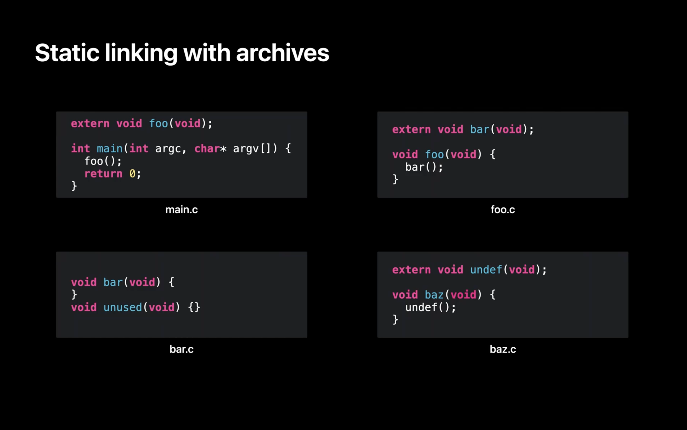

In the previous post we talked about a problem with the linker: Linking a single function from a library could link to the _entire_ library. This creates a lot of bloat. 
Some more enhancements were made to linker. 

But before we dive deeper, it's critical that I note something. To understand 'Static' vs 'Dynamic'. Don't try to compare 'Static Library' vs 'Dynamic Library'. Instead try to compare "Static Linking' vs. 'Dynamic Linking'. If you understand that then you understand everything else. 

## Selective Loading

In a nutshell if you have the following code: 

`extern` means that the function is coming from an external file. Without it the individual file won't compile.  

### File Structure
- In main.c, there's a function called "main" that calls a function "foo". 
- In foo.c, there is foo which calls bar. In bar.c, there is the implementation of bar but also an implementation of another function which happens to be unused. 
- Lastly, in baz.c, there is a function baz which calls a function named undef. 

Now we compile each to its own .o file. 

- foo, bar, and undef are undefined [They're marked with `extern` i.e. they're not defined within the file that attempts to use them]. That is, a use of a symbol and not a definition. 

Now, let's say you decide to combine bar.o and baz.o into a static library. Next, you link the two .o files and the static library. Let's step through what actually happens.

### How linker works
First, the linker works through the files in command line order. The first it finds is main.o. It loads main.o and finds a definition for "main", shown here in the symbol table. But also finds that main has an undefined "foo". 

The linker then parses the next file on the command line which is foo.o. This file adds a definition of "foo". That means foo is no longer undefined. But loading foo.o also adds a new undefined symbol for "bar". 

Now that all the .o files on the command line have been loaded, the linker checks if there are any remaining undefined symbols. In this case "bar" remains undefined, so the linker starts looking at libraries on the command line to see if a library will satisfy that missing undefined symbol "bar". 

The linker finds that bar.o in the static library defines the symbol "bar". So the linker loads bar.o out of the archive. 

At that point there are no longer any undefined symbols, so the linker stops processing libraries. 

The linker moves on to its next phase, and assigns addresses to all the functions and data that will be in the program. Then it copies all the functions and data to the output file. Et voila! You have your output program.

## Still confused. Let's try answering some common questions:

### When does the linker finish?
As soon as they're no longer any undefined symbols. The linker is much like fixing a puzzle. You start with a piece, its edges need other pieces to complete. You keep on adding more pieces. You stop when the last piece is added. Since there's nothing more to add. 

### How are the compiler and linker different? 
The compiler needs to know what the other symbols are in order to compile code that uses them.  
The linker combines these object code files into an executable. The linker needs to know where the other symbols are in order to link code objects that use them.

FWIW many IDEs invoke them in succession, so you never actually see the linker at work. Some languages/compilers do not have a distinct linker and linking is done by the compiler as part of its work. 

With Xcode you use:
 - `swiftc` which ends up calling `swift-frontend` to compile Swift files
 - `clang` to compile C family of code. 
 - `ld` or `clang` to link object files. 

A bit more about the Linker:
> It's one of the final processes in the build. And what we do is we combine all of these .o files that have been built by the two compilers (clang and swift) into an executable.
> All it does is move and patch code. It cannot create [object] code, and this is important and I will show that in the example. 
> But we take these two kinds of input files. The first one being object files. Which are what come out of your build process. And the second one being libraries which consist of several types including dylibs, [tbd's](https://developer.apple.com/videos/play/wwdc2018/415/?time=2858), and .a files (or static archives).
>
> So what are symbols? A symbol is just a name to refer to a fragment of code or data.
> These fragments may refer to other symbols which you would see if you write a function that calls another function.
> Symbols can have attributes on them that affect how the linker behaves. And there are a lot of these. I'm just going to give you one example which is a _weak_ symbol. So a weak symbol is an annotation on a symbol that says it might not be there when we run the executable on the system. This is what all the availability markup that says this API is available on iOS 12. And this API's available on the iOS 11. This, that's what it all boils down to by the time it gets to the linker. So the linker can determine what symbols are definitely going to be there versus what symbols it may have to deal with at runtime.
>
> from [here](https://developer.apple.com/videos/play/wwdc2018/415/?time=2673)
#### Who generates the binary?
The compiler doesn't generate an executable.
The linker does that. 

#### Are they done in parallel? 
Compilation is done in parallel.
Linking is done serially — after all compilation is done. 

#### What's the input/output of each?
The input of the compiler is source code. Its output are object files.
The input of the linker are object files. Its output is some binary (dylib or an app binary).
Compiler will compile every piece of source code. 
The Linker will only link object files that are needed. If a certain object file / symbol isn't needed then it won't get linked. 

#### Does Compilation take more time or linking?
Usually compilation takes a lot more time, because there's a lot of static analysis that your compiler needs to do to validate everything. And while developers don't care if their build time took a couple seconds longe,  users certainly care significantly if the app launch took a few seconds. This is why finding the right balance between the right amount dynamic and static libraries is critical. 

#### How do you access symbols from another file?
- Declare a header file. Include the header file where needed.
- Use `extern` to mark a symbol as external to the current file. It will get resolved at link time. Swift doesn't use `extern`
- Use a library and import everything within it.
- Have a language construct along with certain build tools that understand how your code is to be packaged as a module. That is why you don't need to include a header, or mark as extern. The compiler just knows that foo, bar, baz are all part of the same module. Hence have access to the _internal_ symbols. This is how Swift works. You don't need to import/include the header file of another file in your same module. 

#### Do you ever link a static library into a dynamic library? 
HELL NO!

You only link statically into an executable. If we have the possibility of linking the same (static) library with all dynamic libraries that need it. What happens instead is that each dynamic library also links back to other dynamic libraries within your app container. 

## So what problems exist with Static Linking?
Other than slower build times: 

- You'd have to link a library with all executables. This means if apps and app extension (appex) both need library Foo, then both need to link to it. As a result you end up patching Foo library 2 times. 
- app code without the library is 20MB
- appex code without the library is 10MB

Both link with Foo library statically. Assume both need all symbols in Foo library and Foo library is 5MB. 
## Comparison of Static vs Dynamic

|        Feature                | Static Linking | Dynamic Linking |
|  ---------------------------- | -------------- | --------------- |
|           Naming              | The linking is done at compile time. Compile time is a _static_ concept. | The linking is done at runtime. Runtime is a _dynamic_ concept  |
|       Build Duration          | Linked into the app's main executable during static linking. This leads to slightly slower build time. | It's not linked into the app binary. Has its own binary |
|       Launch Duration         | Everything is already linked. You incurred the linkage cost during build time | It will get linked later — during **launch** time. This can lead to slightly longer launch times. |
|      Selective Loading        | Only symbols that are needed get linked | All symbols of the framework will get linked at launch time. There is no selective loading. |
|           Format              | `.a` | `.dylib` or more commonly `.framework` |
|    Location in App Wrapper    | It becomes part of the app's main executable binary |  Within the `.app` bundle under the `/Frameworks`. e.g. `/Frameworks/fun.Framework/fun` (along with other needed resources) |
|   Ability to Share            | Since it's indistinguishable from the app's binary it can't be shared with another binary/process | The binary can get shared with other processes or dylibs within the app container. You can share a framework between your app and all extensions.† |
|       dSYM location           | its debug symbols will be part of the app's main executable | its debug symbols will separate from the app's main executable |
|       tool used to link       | `ld` | `ld` during compilation. `dyld` at runtime |
|       tool used to create     | `ar` the archiver | `ld` the linker |
|       How to strip            | Will use same stripping flags main app's executable | must be stripped individually |

†: You can not share dylibs with apps outside your app container. Example The Facebook app and its Messenger app can't use the same dylib, even though they're from the same company. 

Note: Apple Frameworks are special. 
- **OS doesn't get bloated:** You link to them, but don't copy them. Also they can be shared between different apps of different companies. Example: The Uber and Lyft apps can use `MapKit.framework` without needing it to be included on the OS twice. Like imagine if there was a `Networking.framework` where app apps needed it for networking operations and since it couldn't be shared, all apps had to include a copy. That mean you'd have to store that framework as your apps.
- **Your app gets new OS features without needing you needing to go through the distribution process again:** Apple Frameworks change with every iOS update. However we don't have to compile our apps again with with the newer iOS version. This is because the newer iOS versions almost never make breaking changes. Apple just dynamically links our app with a newer version of `MapKit.framework`, a newer version of `Networking.framework` and voila! Things just work. 
- **Apps become faster:** Because you can use a shared System framework that's already in memory. Fun fact, after an OS reboot, a lot of the system frameworks haven't been put on the memory. The OS incrementally adds them. The first app you launch after a reboot, usually loads slower, because you need to load a lot of system frameworks. Subsequent apps load a bit faster because their dependencies have been already put into memory either by the OS or some other app. For more on that see [What's the difference between cold launch, warm launch?](https://stackoverflow.com/questions/69623550/whats-the-difference-between-cold-launch-warm-launch).

Had Apple made their system libraries static then every app would have needed to: 
- Link them into the binary -> Apps would get repeatedly bloated for the same binary
- Re-link upon any change in a framework. -> A whole lot more app distribution overhead. 
- Apps will launch slightly slower because instead of using a _shared_ `Network.framework` already in memory, they now have a bigger binary that takes more time to load.

To better understand static and dynamic libraries, I highly recommend going through this [fantastic tutorial](https://medium.com/karlmax-berlin/sub-modules-for-xcode-acb6b1e5f567) written by [Ralph Bergmann](https://twitter.com/Ralph__Bergmann) for how to create your own dynamic frameworks or static libraries. Going through that tutorial helped me see: 
1. How I can simply create libraries without CocoaPods. 
2. Then I inspected each build folder along with the Products folder.

### What's the difference between build folder and Product folder? 
When you want to make a cake, you need flour, milk, sugar, cream, eggs, etc. All of those are intermediate like objects. Anything intermediate goes into the build folder. 
The final product, the cake is what goes in the Product folder. The final cake has the flour, milk, sugar and all, but its glued together in a certain structure. Apple has some pre-defined structures like app bundle or framework bundle. For more on the details of those structures see docs on [Placing Content in a Bundle](https://developer.apple.com/documentation/bundleresources/placing_content_in_a_bundle)

## References
[Mach-O Programming Topics](https://developer.apple.com/library/archive/documentation/DeveloperTools/Conceptual/MachOTopics/1-Articles/building_files.html)