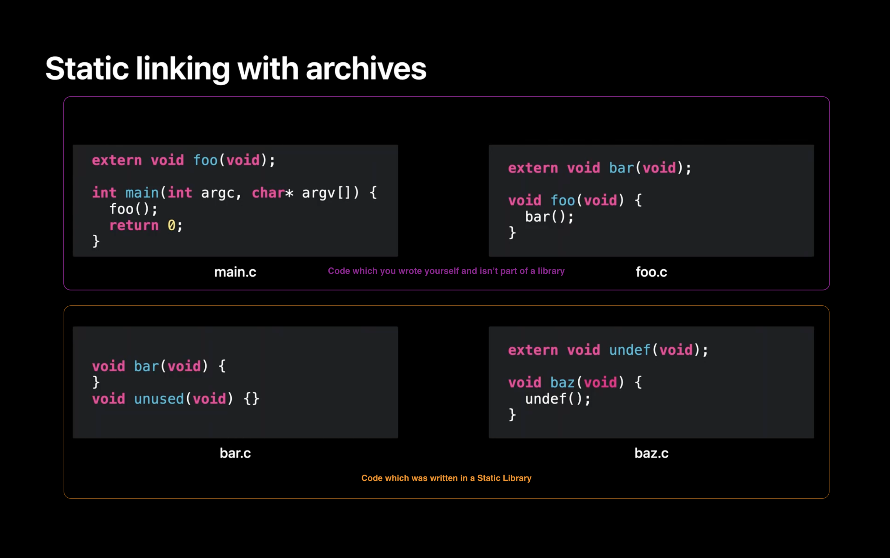
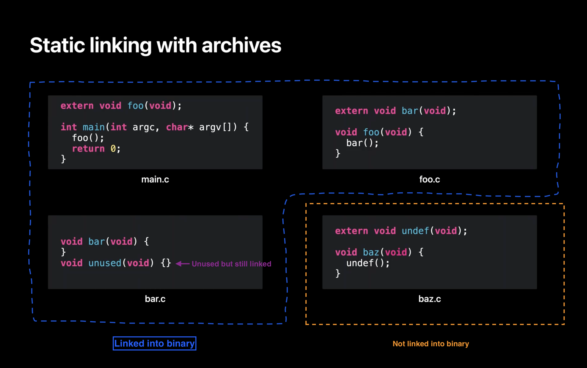

In the [previous post](https://mfaani.com/posts/devtools/optimizing-app-size/jargon/#a-big-final-program) we talked about a problem with the linker: Linking a single function from a library could link to the _entire_ library. This creates a lot of bloat. 
As a result some enhancements were made to linker. The enhancement was to be selective and only load symbols that you need.

Inspired by [Link fast: Improve build and launch times - 4:15](https://developer.apple.com/videos/play/wwdc2022/110362/?time=255):

## Selective Loading

In a nutshell if you have the following source code written in C:



`extern` means that the function is coming from an external file. Without mentioning `extern` the individual file won't compile. 

### File Structure

As you can see above, some functions depend on other functions: 

- In main.c, there's a function called main that calls a function foo. 
- In foo.c, there is foo which calls bar. In bar.c, there is the implementation of bar but also an implementation of another function which happens to be unused. 
- Lastly, in baz.c, there is a function baz which calls a function named undef. 

Now we compile each to its own [.o file](https://mfaani.com/posts/devtools/optimizing-app-size/jargon/#files). 

- foo, bar, and undef are undefined [They're marked with `extern` i.e. they're not defined within the file that attempts to use them]. That is, a use of a symbol and not a definition. 

Now, let's say you decide to combine bar.o and baz.o into a static library. Next, you link the two .o files and the static library. Let's step through what actually happens.

### How linker works
First, the linker works through the files in command line order. The first it finds is main.o. It loads main.o and finds a definition for "main", shown here in the symbol table. But also finds that main has an undefined "foo". 

- main is defined in main.o because we have its implementation and definition. 
- foo is undefined, because we don't have its definition nor its implementation. We only know that it's external

The linker then parses the next file on the command line which is foo.o. This file adds a definition of "foo". That means foo is no longer undefined. But loading foo.o also adds a new undefined symbol for "bar". 

Now that all the .o files on the command line have been loaded, the linker checks if there are any remaining undefined symbols. In this case "bar" remains undefined, so the linker starts looking at libraries on the command line to see if a library will satisfy that missing undefined symbol "bar". 

The linker finds that bar.o in the static library defines the symbol "bar". So the linker loads bar.o out of the archive. 

At that point there are no longer any undefined symbols, so the linker stops processing libraries. 

The linker moves on to its next phase, and assigns addresses to all the functions and data that will be in the program. Then it copies all the functions and data to the output file. Et voila! You have your output program.



### Summary of Static Library

You only include object files that you link against. If you don't link against them, then they don't get included in the final binary.

With that said, the level of control for selecting source code is not the 'type level' nor 'function level'. It's at the 'file level'. This was demonstrated in the example above where `unused` function is linked into the final binary, while the entire baz object file is excluded.
## Let's answer some common Linker questions:

### When does the linker finish linking object files?
As soon as they're no longer any undefined symbols. The linker is much like fixing a puzzle. You start with a piece, its edges need other pieces to complete. You keep on adding more pieces. You stop when the last piece is added. Anything remaining is redundant.

### How are the compiler and linker different? 
See my previous post on [Optimzing App Size - Jargon#Concepts](http://localhost:1313/posts/devtools/optimizing-app-size/jargon/#concepts)
The compiler needs to know what the other symbols are in order to compile code that uses them.  
The linker combines these object code files into an executable. The linker needs to know where the other symbols are in order to link code objects that use them.

FWIW many IDEs invoke them in succession, so you never actually see the linker at work. Some languages/compilers do not have a distinct linker and linking is done by the compiler as part of its work. 

With Xcode you use:
 - `swiftc` which ends up calling `swift-frontend` to compile Swift files
 - `clang` to compile C family of code. 
 - `ld` or `clang` to link object files. 

A bit more about the Linker:
> It's one of the final processes in the build. And what we do is we combine all of these .o files that have been built by the two compilers (clang and swift) into an executable.
> All it does is move and patch code. It cannot create [object] code, and this is important and I will show that in the example. 
> But we take these two kinds of input files. The first one being object files. Which are what come out of your build process. And the second one being libraries which consist of several types including dylibs, [tbd's](https://developer.apple.com/videos/play/wwdc2018/415/?time=2858), and .a files (or static archives).
>
> from [WWDC 2018 - Behind The Scenes of Xcode Build Process](https://developer.apple.com/videos/play/wwdc2018/415/?time=2673)

Also See [Compiling and Linking - Alex Allain](https://www.cprogramming.com/compilingandlinking.html)
#### Which tool generates the binary?
The compiler doesn't generate an executable.  
The linker does that. 

#### Is compilation and Linking done in parallel? 
Compilation is done in parallel.  
Linking is done serially — after all compilation is done. 

#### What's the input/output of each?
The input of the compiler is source code. Its output are object files.
The input of the linker are object files. Its output is some binary (dylib or an app binary).
Compiler will compile every piece of source code. 
The Linker will only link object files that are needed. If a certain object file / symbol isn't needed then it won't get linked. 

#### Does Compilation take more time or linking?
Usually compilation takes a lot more time, because there's a lot of static analysis that your compiler needs to do to validate everything. And while developers don't care if their build time took a couple seconds long,  users certainly care significantly if the app launch took a few seconds. This is why finding the right balance between the right amount dynamic and static libraries is critical. Apple recommends you try things out both ways and then profile things to make sure you're making the best decision. 

### How do you access symbols from another file?
Different languages have different ways of doing things. The different options are:

- Declare a [header file](https://mfaani.com/posts/devtools/optimizing-app-size/jargon/#files). Include the header file where needed.
- Use `extern` to mark a symbol as external to the current file. It will get resolved at link time. Swift doesn't use `extern`
- Use a library and import everything within it.
- Have a language construct along with certain build tools that understand how your code is to be packaged as a module. That is why you don't need to include a header, or mark as extern. The compiler just knows that foo, bar, baz are all part of the same module. Hence have access to the _internal_ symbols. This is how Swift works. You don't need to import/include the header file of another file in your same module. 

## So with 'selective loading' we resolved the bloat issue. Are there any other issues with Static Linking? Why do we need dynamic linking?

Think about how will adding libraries scale over time, as there is more and more source code. It should be clear that as more and more libraries are made available, the end program may grow in size. That means the static link time to build that program will also increase over time.

What if we switched from using 'ar' to 'ld'? As a result the output of library is now an executable binary. This was the start of dynamic libraries in the '90s. As a shorthand, we call dynamic libraries "dylibs". On other platforms they are known as DSOs or DLLs. 

So what exactly is going on here? And how does that help the scalability? 

**The key is that the static linker treats linking with a dynamic library differently. Instead of copying code out of the library into the final program, the linker just records a kind of _promise_**. 

That is, it records the symbol name used from the dynamic library and what the library's path will be at runtime. How is this an advantage? 

1. It means **your program file size† is under your control**. It just contains your code, and a _list_ of dynamic libraries it needs at runtime. You no longer get copies of library code in your program. Your program's static link time is now proportional to the size of _your code_, and independent of the number of dylibs you link with. 

2. Also, the Virtual Memory system can now shine. When it sees the same dynamic library used in multiple processes, the Virtual Memory system will re-use the same physical pages of RAM for that dylib in all processes that use that dylib. 

3. Using dynamic libraries speed up _build time_. 

4. You can share libraries with your other app extensions. 

Let's assume you have: 
- app code that without linking to another library has a size of 20MB
- appex (app extension) that without linking to another library has a size of 7MB

And both need to link to a static library named Foo. Assume Foo library is 5MB. Also assume both need all symbols in Foo library i.e. all symbols of Foo library will get linked. 

In this scenario, your total app size is increased 5Mb when Foo library is statically linked into app's main binary. And also increased another 5Bm when Foo library is statically linked into the appex binary. 

If Foo library was instead linked dynamically with both, then both it would increase the app size by only 5Mb, because the library can be shared. 

I've shown you how dynamic libraries started and what problem they solve. But what are the "costs" for those "benefits"?

1. Launching your app is now slower. This is because launching is no longer just loading one program file. Now all the dylibs also need to be loaded and connected together. In other words, you just _deferred_ some of the linking costs from _build_ time to _launch_ time. 

2. A dynamic library based program will have more dirty pages. In the static library case, the linker would co-locate all globals from all static libraries into the same DATA pages in the main executable. But with dylibs, each library has its DATA page. 

3. Dynamic linking is that it introduces the need for something new: a dynamic linker! Remember that promise that was recorded in the executable at build time? Now we need something at runtime that will fulfill that promise to load our library. That's what `dyld`, the **dynamic linker**, is for.

†: Program file size does not mean the 'app size'. It means the [main app executable](https://mfaani.com/posts/devtools/optimizing-app-size/jargon/#files) size. Example, consider the following:   

```
Foo.app
 - Foo (binary) <- Program file size refers to this. It does not refer to everything that's within the app.
 - bar (dylib)
 - baz (dylib)
 - qux (dylib)
```

 One of the biggest size benefits of dynamic linking is when one of the dynamic libraries you link to, is a _system_ framework. In that case:
 - You don't have to download/install that dynamic library. Because the library was there when you installed/updated the OS. In other words its size doesn't affect your app size. It only affects the OS size. 
 - The OS can update the dynamic library and add new features without you having to do anything. This isn't a size impacting feature. But is also a worthy byproduct. 

## Static Linking vs Dynamic Linking in more detail. 

Before we dive deeper into static library vs dynamic library, it's critical to note something:

In order to understand 'Static' vs 'Dynamic', don't try to compare 'Static Library' vs 'Dynamic Library'. Instead try to compare "Static Linking' vs. 'Dynamic Linking' i.e. focus on the manner of linking as opposed to the nature of the library itself. Once you understand Static vs Dynamic Linking then you can understand Static vs Dynamic Library. 

At the high level, you defer linking to the library to runtime time. This comes with some benefits which we'll discuss. 

### Can you link a library to another library? 

Yes. It's very common to link a dynamic library to another. But you almost never link a static library into a dynamic library
Unless the static library is exclusively used by the dynamic library.

You mostly statically into an app's main executable. 

The idea is:
- Link things statically if they're always needed or if you want to reduce launch time. 
- Link things dynamically if they're needed on demand or if you want to reduce build time. 

That said statically linking to a dynamic library can happen and it will lead to hard to track bugs. See [Link fast: Improve build and launch times 15:16](https://developer.apple.com/videos/play/wwdc2022/110362/?time=916): 

> When a static library is incorporated into multiple frameworks. Each of those frameworks runs fine in isolation, but then at some point, some app uses both frameworks, and boom, you get weird runtime issues because of the multiple definitions. The most common case you will see is the Objective-C runtime warning about multiple instances of the same class name. Overall, static libraries are powerful, but you need to understand them to avoid the pitfalls. 

And this something difficult to anticipate. Hence it's better to just avoid static linking into a dynamic library. 


### Static vs Dynamic Linking Table


†: You can not share dylibs with apps outside your app container. Example The Facebook app and its Messenger app can't use the same dylib, even though they're from the same company. 

### Note: Apple Frameworks are special. Reasons:

- **OS doesn't get bloated:** You link to them, but don't copy them. Also they can be shared between different apps of different companies. Example: The Uber and Lyft apps can use `MapKit.framework` without needing it to be included on the OS twice. Like imagine if there was a `Networking.framework` where app apps needed it for networking operations and since it couldn't be shared, all apps had to include a copy. That mean you'd have to store that framework as your apps.
- **Your app gets new OS features without needing you needing to go through the distribution process again:** Apple Frameworks change with every iOS update. However we don't have to compile our apps again with with the newer iOS version. This is because the newer iOS versions almost never make breaking changes. Apple just dynamically links our app with a newer version of `MapKit.framework`, a newer version of `Networking.framework` and voila! Things just work. 
- **Apps loads faster:** Because you can use a shared System framework that's already in memory. Fun fact, after an OS reboot, a lot of the system frameworks haven't been put on the memory. The OS incrementally adds them. The first app you launch after a reboot, usually loads slower, because you need to load a lot of system frameworks. Subsequent apps load a bit faster because their dependencies have been already put into memory either by the OS or some other app. For more on that see [What's the difference between cold launch, warm launch?](https://stackoverflow.com/questions/69623550/whats-the-difference-between-cold-launch-warm-launch).

Had Apple made their system libraries static then every app would have needed to: 
- Link them into the binary -> Apps would get repeatedly bloated for the same binary
- Re-link upon any change in a framework. -> A whole lot more app distribution overhead. 
- Apps will launch slightly slower because instead of using a _shared_ `Network.framework` already in memory, they now have a bigger binary that takes more time to load.

## References
To better understand static and dynamic libraries, I highly recommend going through this [fantastic tutorial](https://medium.com/karlmax-berlin/sub-modules-for-xcode-acb6b1e5f567) written by [Ralph Bergmann](https://twitter.com/Ralph__Bergmann) for how to create your own dynamic frameworks or static libraries. Going through the tutorial helped me see: 
1. How I can simply create libraries **without CocoaPods**. 
3. Then I inspected each build folder along with the Products folder.
2. The drastic differences between the Xcode setup between a static library vs a framework. 
