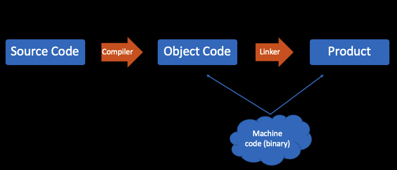
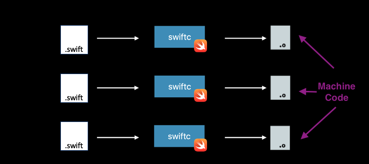
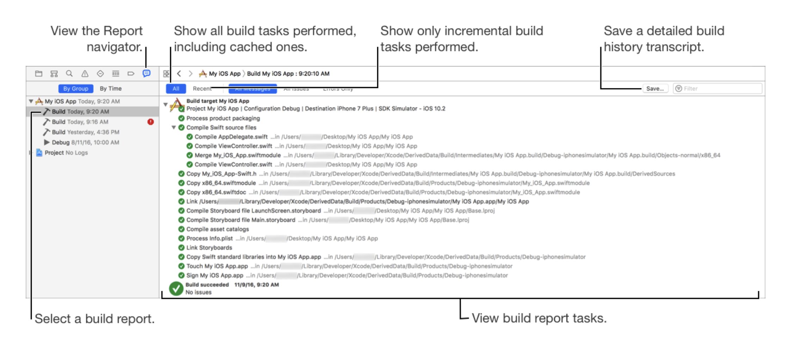

To understand this post, I highly recommend everyone to watch the [WWDC 2022 - Link fast: Improve build and launch times](https://developer.apple.com/videos/play/wwdc2022/110362) and [WWDC 2018 - Behind the Scenes of the Xcode Build Process](https://developer.apple.com/videos/play/wwdc2018/415/). They're of the best talks I've ever seen. 

This post covers some of the jargon and how it all comes together. And even though I love making puzzles, I'll justify why I picked it as my cover. 

## Files
- `.c`: A source code file written in C programming language.
- `.swift`: A source code file written in Swift programming language.
- `.o`: A machine code interpretation of the source code. An intermediate file. Also known as an object file. Named as such, because it's the object/goal of our source code.
- `.h`: A file that doesn't contain implementation. But only the interface.
- `.a`: An archive file. Made up from multiple `.o` files. Also known as a **Static Library** or **Archive**. 
- `.dylib`: A separate binary, from the main executable. Gets linked with the app’s executable at runtime. Gets copied into the app wrapper. As a result, the main executable is smaller and, because the code is loaded only when it is needed, the build time is typically faster. Also known as **Dynamic Library**. Often they also have an empty file type. 
- ` ` : (commonly with empty file types). A binary. For the scope of our discussions our focus is mostly on dylibs or app executables. Binaries in the Apple world (OSX and iOS) usually don't have a file type. They're the end product, the program that gets ran/executed. 
As the name suggests it's just 0s and 1s. It's the lowest possible language level. You can't get any lower than that. Some examples of an executable are: 
    - An iOS app's main executable: An app you open on your iPhone, ends up calling the app's executable. Example the Safari app on your iPhone has a `Safari` executable. 
    - Other Examples - macOS binaries: Some examples that you use in the command line are: `ls`, `cp`, `mkdir`, `pwd` . Every time you do `ls`, you're calling a binary somewhere in your macos. Executables are also known as binaries. See [docs](http://www.linfo.org/bin.html) on `/bin`. Also see the `/bin` directory below:

- `.dSYM`: In short, it's a debug information file. For more see [here](https://stackoverflow.com/a/48548774/5175709)

- 'main app executable': An app may have multiple executables. Examples of this happening: 
    - An iOS app that has app extensions. App extensions are also executable. But aren't the _main_ executable. 
    - A command line interface that has. Users won't have to call your other executables. But your main app will likely call the other executables. 

## Syntax
- `extern` A C concept. Doesn’t exist in Swift. It’s an instruction/promise to the compiler which tells it that a given symbol is defined in _another_ file. Without it, the compilation of the file which depends on the external symbol (function/variable) will fail. Additionally when the linker sees extern before function declaration, it looks for the definition in another C file.

Other languages have _header files_ which they include. Swift is made more simple. It just compiles a module entirely. So as long as what you need is declared in the same module, then things will compile without having a need to import/include. If it's declared in _another_ module, then you just need to import that module. You don't need to single out a file. This is a convenience made by swift. 

## Bundles (Structured directories)
- `.framework`: A bundle directory. If you've seen my previous post on [Whats the Difference Between an App (bundle) and a Binary](https://mfaani.com/posts/devtools/whats-the-difference-between-an-app-bundle-and-a-binary/), then a framework is much like a wrapper, but for a dylib.
- `.app`: A bundle directory. See my previous post on [Whats the Difference Between an App (bundle) and a Binary](https://mfaani.com/posts/devtools/whats-the-difference-between-an-app-bundle-and-a-binary/).
 
## Tools:
- `cc`: Compiler
    - Converts a `.c` file to an executable. 
    - Converts multiple `.c` files into a `.o` file. 
    - Can't be used to compile swift files. Must use `swiftc` instead.
- `clang`: Apple's compiler for the C family language (C, C++, Objective-C, Objective-C++). `cc` is more of a universal term. 
- `ld`: The Linker. Converts `.o` files into an executable. Also known as the Static linker. This is an extremely important part of the whole build process.
- `ar`: An archiving tool. Helps to combine files together. Originally used for backups and distributions. Converts multiple `.o` files into a `.a` file. The difference between `ar` and `ld` is that:
    - `ar` just groups together object files. The product of that is a static library. 
    - `ld` creates an app or a dylib. And can do such with some (stripping related) optimizations. 
- `dyld`: The runtime linker, for dynamic linking a.k.a. 'dynamic link editor'.
- `swiftc`: Is the command-line interface to the Swift compiler, which is responsible for compiling Swift source code into machine code that can be run on a computer. It basically does what `cc` does for `.c` files, but just for `.swift` files. It's ultimately a symlink to `swift`. For more on that see [here](https://stackoverflow.com/questions/57777091/whats-the-difference-between-swift-and-swiftc)
- `strip`: Used to strip symbols of all kinds from binaries. You can strip various kinds of symbols
    - Debug Symbols
    - Swift Symbols
    - Global Symbols
    - Non-Global Symbols
    - All Symbols
    - etc.  
    <!-- -->
    Stripping basically does two things for you:  
    - It removes access to a certain symbol. 
    - It removes the code for that symbol.
- `dysmutil`: Is applied against a non-stripped binary. It links all DWARF and debug information into a binary and creates the dSYM. 

## Concepts
- Compilation: Converting source code within a single file into machine code. 0s and 1s. The output of compiling a single file is a single object file. 
- Machine Code: Anything that's written in zeros and ones. So the CPU can understand them. You may compile a single file into machine code, but that doesn't mean that the single machine code instructions is enough to execute something. Often you need multiple machine code instructions to be able to complete some basic operations. 
- Linking: Piecing different object files together to create a binary. 

To put all these concepts together. See the following images: 

### High Level

### 1. Compilation

### 2. Linking
. For each of those dependencies it has to find their dependencies as well. Once all are found, it stops linking. The product of linking all object files together is your app binary or dynamic library's binary.")


## Quick Summary - How do all the tools and files work together? 
1. All source files are compiled into an intermediate file known as object code/file (.o file)
2. Any needed object file will get linked together. Often you link source code and libraries together. 

The compiler creates an object file. But a file by itself is useless. They're like a piece of a puzzle. 
The linker links all necessary object files, and creates the final binary. Similar to how a puzzle maker places all the puzzle pieces in place. 

## Xcode Jargon

### Dependency order 

Build Process Represented as a Directed Graph

> What happens when you press build? So the first step is for the build system to take the build description, your Xcode project file. Parse it, take into account all the files in your project, your targets and the dependency relationships. Your build settings, and turn it into a tree-like structure called a directed graph

The order: 
- Knowledge built into the system
- Target Dependencies
- Implicit Dependencies
- Build Phase Dependencies
- Scheme order Dependencies 

### [Incremental Build](https://developer.apple.com/videos/play/wwdc2018/415/?time=407)

"The bigger your project, the longer the build process will take. So you don't want to run all of these tasks every single time you build.
Instead, the build system might only execute a subset of the tasks on the graph. Depending on the changes you've made to your project since the previous build.
We refer to this as an 'incremental build' and having **accurate dependency information** is very important in order for incremental builds to work correctly and efficiently. 

Now we talked about how changes affect the build system, and how they relate to incremental builds. So how does the build system actually detect changes? Each _task_ in the build process has an _associate signature_ which is the sort of _hash_ that's computed from various information related to that task.
This information includes the stat of the task's _inputs_ like:
- File paths
- Modification time stamps. 
- The _command line indication_ used to actually perform the command.
- Other task-specific metadata such as the _version of the compiler_ that's being used.

The build system keeps track of the signatures of tasks in both the current and the previous build. So that it knows whether to rerun a task each time a build is performed."

Ultimately what this means is that every time you click build, Xcode won't necessarily re-compile everything from scratch. 

Things get compiled depending on: 
1. What's already compiled and exists in the build directory.
2. What's changed in source code or compilation instructions.  

If you didn't change the interface of a function then all you have to do is recompile its file and you're good. But if you did change a function's interface, then you need to recompile that file and all its other dependencies. 

To see what steps were performed for your recent build you can use the [Report Navigator](https://help.apple.com/xcode/mac/current/#/devb7cf06445). Then just click on Build with the appropriate timestamp. Some suggestions for what keywords to search for are: 
- Compile
- Link
- Create Directory
- Copy



### Frameworks, Libraries, and Embedded Content 

- Frameworks: is just a different packaging for dylibs. **adds a copy of that framework into your application bundle under the `Frameworks` directory by default**. For more see [Big Nerd Ranch](https://bignerdranch.com/blog/it-looks-like-you-are-trying-to-use-a-framework/)
- Libraries: Static Libraries. The object files get absorbed into the main app's executable.
- Emebedded Content: App Extensions. There's no linking involved. Yet you have to copy them into your app bundle. 

Essentially all three are different form of dependencies of your app's main executable. 

### What's the difference between 'Build folder' and 'Product folder'? 
When you want to make a cake, you need flour, milk, sugar, cream, eggs, chocolate chips, oven, mixer, etc. All of those are intermediary objects. Anything intermediate goes into the build folder. 
The final product, the cake is what goes in the Product folder. The final cake has the flour, milk, sugar and all, but its glued together in a certain structure. Although the chocolate chips are distinguishable from the cake. The rest are not. 

Building an app is similar to that. In the build folder you'd see the built static and dynamic libraries.  
However in the Products folder, you see the app's main executable and its dynamic library. The static libraries are already merged into the app's main executable. 

If you deleted the Build Folder, then app will still get ran on the device/simulator. However if you deleted the Products folder, then you need to produce those again. The Product is what's needed to _run_ the app. The build folder is what's needed to just _build_. Real world users when they unpack the app, they end up with something very similar to what we have in the Products folder. 

Why is this important? It's important to understand because if you ever need to dig into the products folder to find your static library, well you'll _never_ find it. You have to go looking for it in the Build folder as static libraries get merged into the app's executable. 
 

FYI Apple has some pre-defined structures like app bundle or framework bundle. For more on the details of those structures see docs on [Placing Content in a Bundle](https://developer.apple.com/documentation/bundleresources/placing_content_in_a_bundle).

## Summary

### 1 - Dependency Order
Xcode will see that your Cool.app depends on its libraries. 

In my example the Cool app depends on Core (dynamic) library and Auth (static) Library 
### 2 - Compile dependencies
```
Model.swift -> `swiftc` -> Model.o
                                    Model.o + Controller.o -> `ld` -> Core (dylib a.k.a Dynamic library) 
Controller.swift -> `swiftc` -> Controller.o
```
---
```
Auth.swift -> `swiftc` -> Auth.o
                                        Auth.o + Token.o -> `ar` -> libAuth.a (a Static library)
Token.swift -> `swiftc` -> Token.o
```
### 3 - Create App Wrapper
```
mkdir Cool.App
```

### 4 - Compile App code
```
Foo.swift -> `swiftc` ->  Foo.o
                                 Foo.o + Bar.o + libAuth.a + Core (dylib) -> `ld` -> cool - a binary that's made up of Foo.o, Bar.o and object files from within libAuth.a                                                                          
Bar.Swift -> `swiftc` -> Bar.o
```

`cool` executable is placed within `Cool.App` directory. 
### 5 - Embed/Copy binaries into the App Wrapper

- Copy `Family` dylib within `Cool.App/Frameworks` directory.

### The app wrapper will be similar to: 
```
cool.app (an app wrapper)
    - cool - a binary that's made up of Foo.o, Bar.o and Vehicle.a
    - /Frameworks
        - Family.framework
            - Family (dylib)
```

### 6 - App Launch
- User taps on cool.app
- cool binary is loaded into memory
- `dyld` loads the dependencies of cool binary -> Family dylib is loaded into memory. 
- App is ready to use. 

## Where can things go wrong? 

### Dependency Order
- App binary is getting compiled before library is compiled. 
- App binary is compiled with old compiled library code. This can happen when 'Find Implicit Dependencies' is disabled in Scheme's Build action. 

### Compilation
- Typo in your symbols
- Missing a `{`, `:` , `]`, etc
- Not declaring a variable
- Not matching the interface of a function or not conforming to the protocol interface.
- Not importing a needed library
- etc.

### Linking
- Library is in the same Xcode workspace. However there's no linkage defined between the app binary and the library.
- The implementation of something you linked to is missing. 
- Two implementations exist for a given symbol. 

### Loading
- The dynamic library isn't copied into the /Frameworks directory.
- The name of the dynamic library doesn't match with what's expected.
- The dynamic library is moved from its location. 
- The dynamic library is stripped of all its global symbols. Hence the main app can't communicate with the dylib. 

## Any last notes?

A big help in figuring these things out was just simply looking into the man (or help) pages of `ld`, `dyld`, `clang`, `swiftc`, `strip`, `dsymutil`. Make sure you look into for more. 
## A big final program

Suppose you need a single function from a library named `foo.a`. You might end up consuming space for every other variable, function, type in library `foo`. 

What can you do resolve this? Hopefully I'll discuss this in my next upcoming post


[👉 Next Post - How Does the Linker Help Reduce App Size? What are the different types of linking - Part One](https://mfaani.com/posts/devtools/optimizing-app-size/how-does-the-linker-help-reduce-app-size-part-one/)