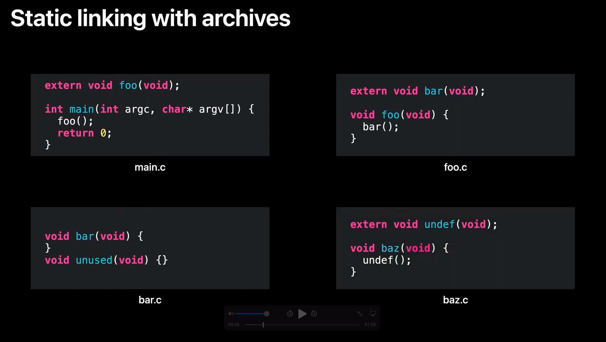

To understand this post, I highly recommend everyone watches the [WWDC 2022 - Link fast: Improve build and launch times](https://developer.apple.com/videos/play/wwdc2022/110362). It's one of the best talks ever. 

Some jargon I learned from watching: 

## Files
- `.c`: A source code file written in C programming language.
- `.o`: An intermediate object file. Also known as an object file. Made up from multiple `.c` files.
- `.a`: An archive file. Made up from multiple `.o` files. Also known as a **Static Library**.
- `.dylib`: Linked with the app’s executable at runtime, but not copied into it. As a result, the executable is smaller and, because the code is loaded only when it is needed, the startup time is typically faster. Also known as **Dynamic Library**.
- ` ` : (empty file type). A binary. An executable. Executables usually don't have a file type. They're the end product, the program that gets ran/executed. 
As the name suggests it's just 0s and 1s. It's the lowest possible language level. You can't get any lower than that.  Some examples of an executable are: 
    - iOS app: An app you open on your iPhone, ends up calling the app's executable. 
    - Static Library: An app may use an executable (library) to _build_ itself.  
    - Dynamic Library: An app may also use an executable (library) to _build **and** launch_ itself. 
    - Other Examples - macOS binaries: Some examples that you use in the command line are: `ls`, `cp`, `mkdir`, `pwd` . Every time you do `ls`, you're calling a binary somewhere in your macos. Executables are also known as binaries. See [docs](http://www.linfo.org/bin.html) on `/bin`. Also see the `/bin` directory below:

## Tools:
- `cc`: Compiler
    - Converts a `.c` file to an executable. 
    - Converts multiple `.c` files into a `.o` file. 
    - Can't be used to compile swift files. Must use `swiftc` instead.
- `ld`: Converts `.o` files into an executable. Also known as (static) linker. 
- `ar`: An archiving tool. Helps to bundle files together. Originally used for backups and distributions. Converts multiple `.o` files into a `.a` file. The difference between `ar` and `ld` is that `ld` creates an executable, whereas `ar` just groups some files together
- `dyld`: A runtime linker, for dynamic linking. 
- `swiftc`: Is the command-line interface to the Swift compiler, which is responsible for compiling Swift source code into machine code that can be run on a computer. It basically does what `cc` does for `.c` files, but just for `.swift` files. It's ultimately a symlink to `swift`. For more on that see [here](https://stackoverflow.com/questions/57777091/whats-the-difference-between-swift-and-swiftc)
- `clang`: Apple's compiler for 'C language family': C, C++, Objective-C, Objective-C++. 

The compiler creates an object file. But a file by itself is useless by itself. They're like a piece of a puzzle. 
The linker links all necessary object files and creates the final binary. 

## Xcode Jargon
- Dependency order 

Build Process Represented as a Directed Graph

> What happens when you press build? So the first step is for the build system to take the build description, your Xcode project file. Parse it, take into account all the files in your project, your targets and the dependency relationships. Your build settings, and turn it into a tree-like structure called a directed graph

The order: 
- Knowledge built into the system
- Target Dependencies
- Implicit Dependencies
- Build Phase Dependencies
- Scheme order Dependencies 

- Incremental Build

And of course the bigger your project, the longer the build process will take. So you don't want to run all of these tasks every single time you build.
Instead, the build system might only execute a subset of the tasks on the graph. Depending on the changes you've made to your project since the previous build.
We refer to this as an incremental build and having accurate dependency information is very important in order for incremental builds to work correctly and efficiently. Now we talked about how changes affect the build system, and how they relate to incremental builds. So how does the build system actually detect changes? Each task in the build process has an associate signature which is the sort of hash that's computed from various information related to that task.
This information includes the stat of the task's inputs like file paths and modification time stamps. The command line indication used to actually perform the command. And other task-specific metadata such as the version of the compiler that's being used.
The build system keeps track of the signatures of tasks in both the current and the previous build. So that it knows whether to rerun a task each time a build is performed.

- `Embedded Binaries`: Embed, means to add a copy of that framework into your application bundle under the `/Frameworks` directory by default. Your application won’t be able to do anything with that Framework unless it links to it. Xcode takes the liberty of doing this for you. (System frameworks are already present on either iOS or macOS so you can safely link to these at the absolute path that they are kept on the system. Your own custom frameworks won’t be present on a user’s system, and therefore they have to be embedded in the application bundle.)
Linking and embedding indirectly imply dynamic and/or static linking. We now know that embedding wouldn’t make any sense for a static library because the symbols from the static library are compiled into the executable, so Xcode won’t let you drop a static library under the Embed section. It will however, let you embed a framework with static libraries. This is an inefficient use of frameworks.
from [Big Nerd Ranch](https://bignerdranch.com/blog/it-looks-like-you-are-trying-to-use-a-framework/)

# Problem - A big final program

Suppose you need a single function from a library named `foo.a`. You end up consuming space for every other variable, function, type in library `foo`. 

What can you do resolve this?  

## Selective Loading

In a nutshell if you have the following code: 

Notice that the keyword `extern` means that the function is coming from an external file. 

### Scenario
- In main.c, there's a function called "main" that calls a function "foo". 
- In foo.c, there is foo which calls bar. In bar.c, there is the implementation of bar but also an implementation of another function which happens to be unused. 
- Lastly, in baz.c, there is a function baz which calls a function named undef. 

Now we compile each to its own .o file. 

- foo, bar, and undef are undefined [They're marked with `extern` i.e. they're not defined within the file that attempts to use them]. That is, a use of a symbol and not a definition. 

Now, let's say you decide to combine bar.o and baz.o into a static library. Next, you link the two .o files and the static library. Let's step through what actually happens.

### How linker works
First, the linker works through the files in command line order. The first it finds is main.o. It loads main.o and finds a definition for "main", shown here in the symbol table. But also finds that main has an undefined "foo". 

The linker then parses the next file on the command line which is foo.o. This file adds a definition of "foo". That means foo is no longer undefined. But loading foo.o also adds a new undefined symbol for "bar". 

Now that all the .o files on the command line have been loaded, the linker checks if there are any remaining undefined symbols. In this case "bar" remains undefined, so the linker starts looking at libraries on the command line to see if a library will satisfy that missing undefined symbol "bar". 

The linker finds that bar.o in the static library defines the symbol "bar". So the linker loads bar.o out of the archive. 

At that point there are no longer any undefined symbols, so the linker stops processing libraries. 

The linker moves on to its next phase, and assigns addresses to all the functions and data that will be in the program. Then it copies all the functions and data to the output file. Et voila! You have your output program.

# Questions

## When does the linker finish/stop?
As soon as they're no longer any undefined symbols. 

## How are the compiler and linker different? 
The compiler needs to know what the other symbols are in order to compile code that uses them.  
The linker combines these object code files into an executable. The linker needs to know where the other symbols are in order to link code objects that use them.

Many IDEs invoke them in succession, so you never actually see the linker at work. Some languages/compilers do not have a distinct linker and linking is done by the compiler as part of its work.

Ultimately compiler is what, linker is where.

A bit more about the Linker:
> It's one of the final processes in the build. And what we do is we combine all of these .o files that have been built by the two compilers (clang and swift) into an executable.
> All it does is move and patch code. It cannot create code, and this is important and I will show that in the example. 
> But we take these two kinds of input files. The first one being object files. Which are what come out of your build process. And the second one being libraries which consist of several types including dylibs, tbd's, and .a files (or static archives).
>
> So what are symbols? A symbol is just a name to refer to a fragment of code or data.
> These fragments may refer to other symbols which you would see if you write a function that calls another function.
> Symbols can have attributes on them that affect how the linker behaves. And there are a lot of these. I'm just going to give you one example which is a _weak_ symbol. So a weak symbol is an annotation on a symbol that says it might not be there when we run the executable on the system. This is what all the availability markup that says this API is available on iOS 12. And this API's available on the iOS 11. This, that's what it all boils down to by the time it gets to the linker. So the linker can determine what symbols are definitely going to be there versus what symbols it may have to deal with at runtime.
>
> from [here](https://developer.apple.com/videos/play/wwdc2018/415/?time=2673)

The compiler doesn't generate an executable
The linker does that. 

Compilation is done in parallel. 
Linking is done after all are done. 

## How do access symbols from another file?
- Declare a header file. Include the header file where needed.
- Use `extern` to mark a symbol as external to the current file. It will get resolved at link time. Swift doesn't use `extern`
- Use a library and import everything within it.
- Have a language construct along with certain build tools that understand how your code is to be packaged as a module. That is you don't need to include a header, or mark as extern. The compiler just knows that foo, bar, baz are all part of the same module. Hence have access to the _internal_ symbols. This is how Swift works. You don't need to import/include the header file of another file in your same module. 

## Is linking and loading the same thing? 
- For Static Linking: Linking to a function is immediately followed by loading the function into the executable.
- For Dynamic Linking: You only link to the promise (interface of a function) during build. The loading of the function's implementation is delayed until the function is needed.

## What's the difference between a framework and a (dynamic) library?
- Library is a set of files. 
    - Its file type is either: `.a` or `.dylib`. They're a binary. 
    - Unlike a static library where it's linked during the build time, a dynamic library is linked at runtime.
- Framework is a set of files bundle/packaged together — along with some other resources. Usually resources are things like storyboards, nibs, headers, localization files. However resources can also be a dynamic library or a static library. A framework can be signed. 
    - Its file type is `.framework` which is in fact a folder. The folder has a certain structure.
    - After linking the framework will still exist within the `.app` package of your app. The framework can be found under `/Frameworks` directory of your app bundle. 

**Note: If you select a Framework target in Xcode, you get a lot more options than what you get for a library target.**

My understanding is that there's a lot more difference that I haven't been able to cover, but this is as far as I could get so far.

## Benefits of Static vs Dynamic

| Linking Type | Build Time | Launch Time | Selective Loading  | format | location | sharing | App Extensions |
| ------------ | -----------| ----------- | ------------------ | ------ | -------- | ------- | -------------- | 
| Static Linker |  The library is linked into the app binary. Becomes part of it. This can lead to slightly slower build time. | Won't impact launch time | only symbols that are needed get linked | .a | it's in the app binary and indistinguishable from the rest of the source code | can't share with another binary/process | If you link statically, then because an app and app extension are separate processes and binaries, then you can't share the library if you link statically |
| Dynamic Linker | It's not linked into the app binary | It will get linked later — during launch time. This can lead to slightly slower launch time. | All symbols of the framework will get linked at launch time | either .dylib or .framework | within the App bundle under the `/Frameworks`. e.g. `/Frameworks/Video.Framework/Video` (along with other needed resources) | given that the binary sits outside the main app binary, then the binary can get shared with other processes within the app container. You can share the same framework dylib with your Messages App Extension or with your Notification Service Extension. This can reduce total app bundle size. Note: You can not share dylibs with apps outside your app container. Example The Meta App and Facebook can't use the same dylib, even though they're from the same company |

Note: Apple Frameworks are special. 
- **OS doesn't get bloated:** You link to them, but don't copy them. Also they can be shared between different apps of different companies. Example: The Uber and Lyft apps can use `MapKit.framework` without needing it to be included on the OS twice. Like imagine if there was a `Networking.framework` where app apps needed it for networking operations and since it couldn't be shared, all apps had to include a copy. That mean you'd have to store that framework as your apps.
- **Your app gets new OS features without needing you needing to go through the distribution process again:** Apple Frameworks change with every iOS update. However we don't have to compile our apps again with with the newer iOS version. This is because the newer iOS versions almost never make breaking changes. Apple just dynamically links our app with a newer version of `MapKit.framework`, a newer version of `Networking.framework` and voila! Things just work. 
- **Apps become faster:** Because you can use a shared System framework that's already in memory. Fun fact, after an OS reboot, a lot of the system frameworks haven't been put on the memory. The OS incrementally adds them. The first app you launch after a reboot, usually loads slower, because you need to load a lot of system frameworks. Subsequent apps load a bit faster because their dependencies have been already put into memory either by the OS or some other app. For more on that see [What's the difference between cold launch, warm launch?](https://stackoverflow.com/questions/69623550/whats-the-difference-between-cold-launch-warm-launch).

@self TODO: 

Reference this as a fantastic  example: 
https://medium.com/karlmax-berlin/sub-modules-for-xcode-acb6b1e5f567

Also talk about the differences of stripping between static vs dynamic...

Had Apple made their system libraries static then every app would have needed to: 
- Link them into the binary -> Apps would get repeatedly bloated for the same binary
- Re-link upon any change in a framework. -> A whole lot more app distribution overhead. 
- Apps will launch slightly slower because instead of using a _shared_ `Network.framework` already in memory, they now have a bigger binary that takes more time to load.

# References
[Mach-O Programming Topics](https://developer.apple.com/library/archive/documentation/DeveloperTools/Conceptual/MachOTopics/1-Articles/building_files.html)