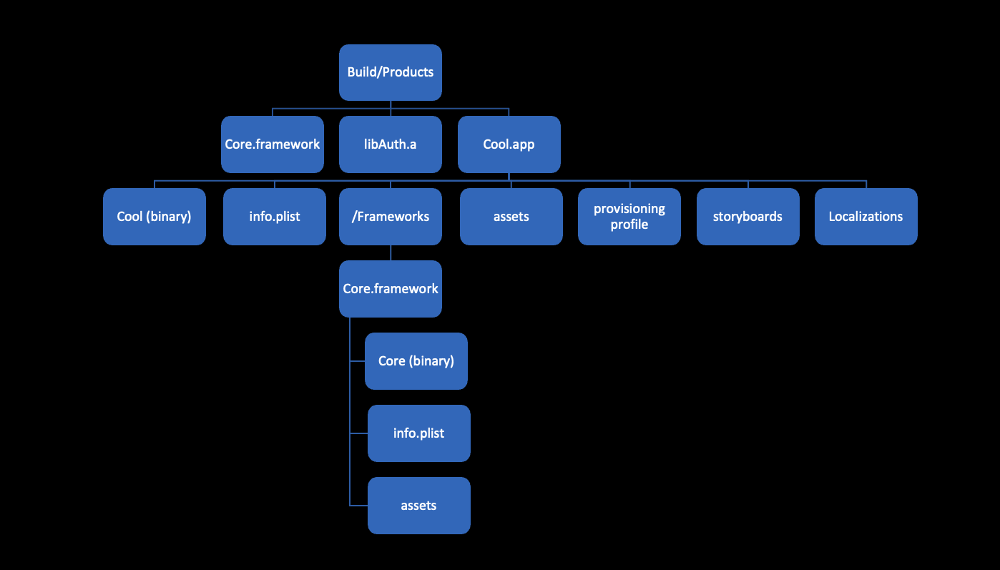

A binary is the final product from [linking](https://mfaani.com/posts/devtools/optimizing-app-size/jargon/#concepts) all your source code. It's executable. You can run commands against it. 

An app, is merely a wrapper / directory, which includes that binary *and* other things. 

## How do you create a binary? 
First it's important to understand what a binary is.
- You've used them every day in the terminal. Examples: `ls`, `cp`, `mkdir`.
- You pass certain parameters to them.
- They don't have any file extension.
- They're in [machine code](https://stackoverflow.com/questions/21571709/difference-between-machine-language-binary-code-and-a-binary-file) i.e. zeros and ones. 

With some simplification, this is how we create a binary from our source code:

 .o -> linked together as a binary")

So now you're wondering what an object code is. 
Object codes, a.k.a object files are: 
- Similar to binaries, object codes are also in binary format.
- Contain undefined symbols; symbols compiled from another source file. 
- Unlike the final binary, an object code is useless by themselves. Because it contains undefined symbols.

Object codes are very much like pieces of a puzzle.

Once you put all these pieces of the puzzle together in perfect order, then you have a complete picture. Much like a binary.

- If a piece of a puzzle is missing, then the linker will make it so that you have an 'undefined symbol' error.  
- If two identical pieces of a puzzle exist, then the linker throw you the 'multiple definitions' error, since it wouldn't know which one to choose.

## OK. So what's an app? 
An app is just a structured directory, containing the binary and some other files. 
If you want to create an app _wrapper_ then all you have to do is: `mkdir Cool.app`. 

When Xcode builds your app, it does it in a two step process: 
1. Build all targets that your app depends on.
2. Create your app wrapper / directory and then copy everything in the right place. To use Xcode jargon, the frameworks will get **Embedded** into the app bundle / wrapper. 

🔍: Make sure you go and inspect the app bundle and see its content. You can even do this for your `/Applications` directory of your macos as well. You can also ditch Xcode and make your app without it. For more on that see [Building osx app bundle](https://stackoverflow.com/questions/1596945/building-osx-app-bundle)

For example if an app named `Cool` had the following dependencies: 
- `Auth.a` (static library)
- `Core.framework` (dynamic library)

Then the `Build/Products` directory will be in this structure:

The `info.plist` has the mapping to know what binary it should refer to as its executable, the name of the app, what image it should use for the app icon, the bundle identifier, OS privacy prompts and many more. So when you double click on `Safari.app` on your macos, it will use the plist and figure out that it needs to open the `Safari` binary within the app wrapper.

## Wrap up
A binary is a standalone thing. An app is a packing of the binary with other stuff.  
Also worth mentioning that while you can [interact with apps through the command line](https://stackoverflow.com/a/1308947), they're usually opened and interacted through some user interface.  
For binaries it depends. If you have an app wrapper, then that's what you'd typically use. Otherwise, you'd be limited to the terminal. 

## Acknowledgements and References
- Huge shout out to some friends (who prefer to not be named) who helped me figure this all out. 
- [Compiler vs Linker - Alex Allain](https://www.cprogramming.com/compilingandlinking.html)
- [WWDC 2018 - Behind the Scenes of the Xcode Build Process](https://developer.apple.com/videos/play/wwdc2018/415/)