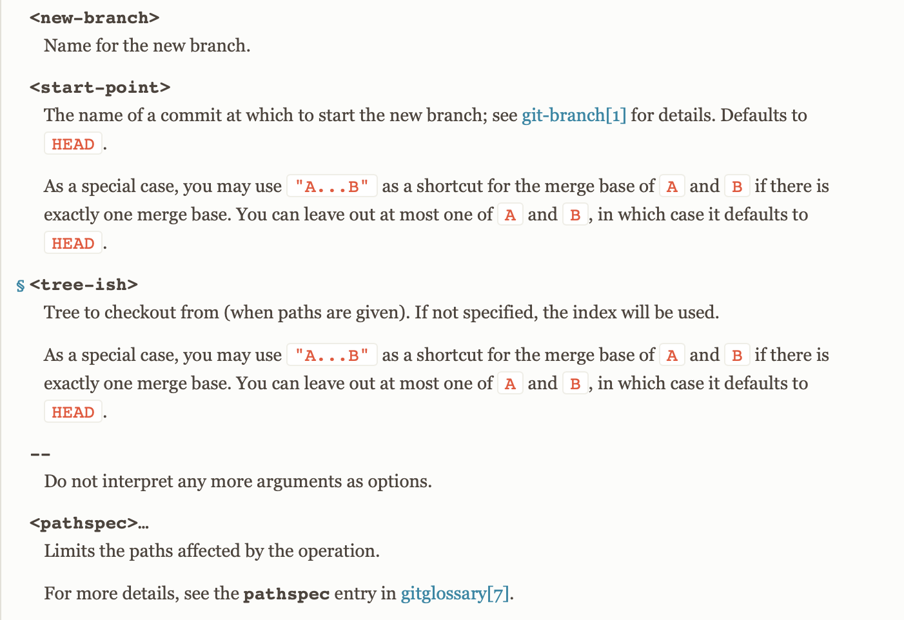

I used to find it super hard to read git syntax. I didn't know what what `--`, `<>`, `[]`, `...`, `|`, `()`, etc meant. 
Turns out, it's a whole lot easier than you think. 

First thing each synopsis contains a list of most likely _forms_ you'd try. 

## Syntax Guide:

- `[ ]` makes things optional.
- `< >` are just placeholders. 
- `...` just means one or more. 
- `|` means: OR
- `( )` just groups things together for easier readings.
- `-b`, `-d`, `--oneline`, `--add` and so on are known as options

Beyond that, if you scroll down, you'd see each page usually (not always) has the following sections, structure. 

## Sections

- Name
- Description
- Options:
- Commands
- Examples
- Notes 
- See Also  

Within the Options sections, the _placeholders_ are better described. The following placeholders are extracted from [git checkout](https://git-scm.com/docs/git-checkout) page:



With this knowledge let's go through some examples: 

### First Example
```bash
git branch (-d | -D) [-r] <branchname>…​
```
Translates to:

- `git branch`
- either `-d` or `-D`
- optional `-r`
- one or more branch names

Meaning, all of the following are accepted: 

```bash
git branch -d branchA
git branch -d branchA branchB branchX
git branch -d -r branchA branchP
```

While the following aren't accepted:

```bash
git branch -d -D branch # can't provide both -d -D together
git branch -d # must provide at least one branch name
```

### Second Example:  
```bash
git remote set-branches [--add] <name> <branch>…​
```

Translates to: 
- `git remote set-branches`
- optional `--add`
- must include name (of the repo)
- one or more branch names

Meaning, all of the following are accepted: 

```bash
git remote set-branches --add origin branchA
git remote set-branches origin branchA
git remote set-branches origin branchA branchB
git remote set-branches --add origin branchA branchB <a lot more branches> branchX
```

While the following aren't accepted:

```bash
git remote set-branches --add origin upstream branchA # you can't do multiple repos. Only multiple branches
git remote set-branches --add origin # you must specify a branch name
```

Now you might be asking what does `name` refer. The answer is, you have to go into the man page and see the description of the command you're using. E.g. the description of: `set-branch` can be found from [here](https://git-scm.com/docs/git-remote#Documentation/git-remote.txt-emset-branchesem) 

> Changes the list of branches tracked by the named remote. This can be used to track a subset of the available remote branches after the initial setup for a remote.
> The named branches will be interpreted as if specified with the -t option on the git remote add command line.
> With `--add`, instead of replacing the list of currently tracked branches, adds to that list.


### Third Example: 

```bash
git diff [<options>] [<commit>] [--] [<path>…​]
```

Translates to: 
- `git diff`
- Any number of options. This is an odd one, because it's not marked with `...`, but the placeholder itself conveys that there can be multiple options. Typically options can be multiple.
- a commit (SHA)
- `--` is just a separator from the options
- zero or more paths

Meaning, all of the following are accepted: 

```bash
git diff . # diff on the current directory
git --name-only 97c8fa32a some/directory # shows the file name of every thing changed (from only inside some/directory) between the current index and the `97c8fa32a` commit 
```


### Forth Example

```bash
git diff [<options>] <commit>…​<commit> [--] [<path>…​]
```

So now you saw this and didn't know what `<commit>…​<commit>` means. It's easier to figure out, because we know what the other parts of this form mean. All we have to do is, search within the [docs of git diff](https://git-scm.com/docs/git-diff). 
> This form is to view the changes on the branch containing and up to the second `<commit>`, starting at a common ancestor of both `<commit>`. [skipping some parts of doc] .You can omit any one of <commit>, which has the same effect as using HEAD instead.

Meaning the following is allowed: 

```bash
git diff --name-only 5a189bf...e48224a
git diff --name-only 5a189bf...e48224a -- some/directory
git diff --name-only 5a189bf...e48224a -- some/directory1 some/directory2
```

## Other notes:

- Understanding what the placeholder is about is key. Take your time and search on the doc page (or on the internet) for it. Common placeholders are: 
    - `<path>`
    - `<pathspec>`
    - `<branch>`
    - `<repo-name>`
    - `<tree-ish>`
    - `<commit>`

- Options and commands are different. 
    - Options are prefixed with `-` or `--`. 
    - Comamnds don't have any `-` or `--` before them. `git add`, `git log`, `git diff`, `git remote`, etc are all different commands. 
    - Some commands have sub-commands e.g. `git remote` has different commands:
        - `git remote add`
        - `git remote remove`
        - `git remote rename`
- Every git command has various options. If you don't set them, then git will fallback to its defaults. A lot of times the current commit, branch, directory get used if you dont' specify antything. 

- The position of `...` is important. Example:  `<branch>...` is different from `[<branch>...]`
    - `<branch>...` means one or more branches.
    - `[<branch>...]` means optionally 1 or more branches. i.e. zero or more branches.


- The git doc pages are not identically structured. If you can't understand the docs, it's not your fault. It's because the documentation is written by lots of different people. 

## Also see: 

[How do I read git synopsis documentation?](https://stackoverflow.com/questions/60906410/how-do-i-read-git-synopsis-documentation/60906506#60906506)
