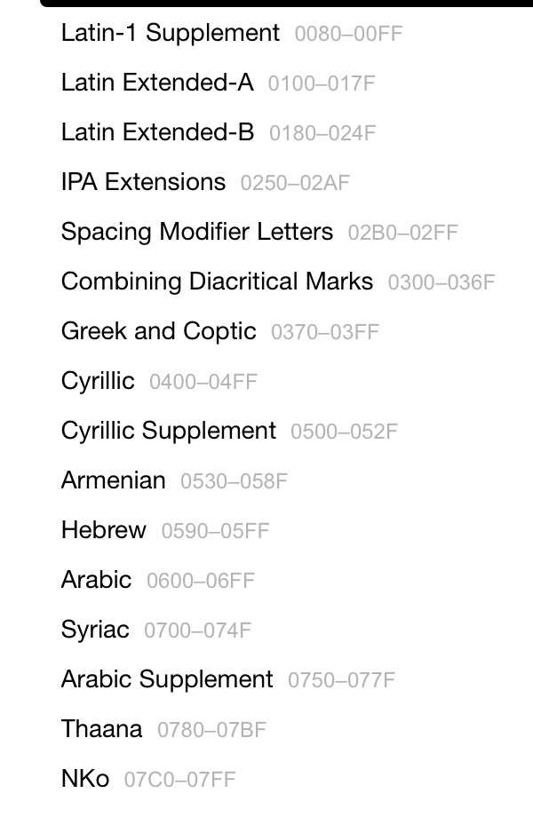

This is a follow up from my previous post: [The power and expressiveness of Swift ranges](http://mfaani.com/posts/swift/the-power-and-expressiveness-of-swift-ranges/).  
For a Character Range:

## `contain` works fine

```swift
let numericalRange = 1...10

numericalRange.contains(8) // true

let a: Character = "a"
let z: Character = "z"
let alphabeticalRange = a...z

alphabeticalRange.contains("k") // true
```

## `for-loop` and `count` don't work

```swift
print(numericalRange.count) // 10
print(alphabeticalRange.count) // ❌ Referencing property 'count' on 'ClosedRange' requires that 'Character' conform to 'Strideable'

for num in numericalRange {
    print(num) // 1 2 3 4 5 6 7 8 9 10
}

for char in alphabeticalRange { // ❌  Referencing instance method 'next()' on 'ClosedRange' requires that 'Character' conform to 'Strideable'
    print(char)
}
```

> What both of those errors mean is that Swift can't figure out what the _next_ character is for a given character. The folks who implemented `Character` chose not to conform it to [`Strideable`](https://developer.apple.com/documentation/swift/strideable).

### I'm confused! Can't Swift know that after "a" there will be "b", then "c" and so on?

You're asking a very good question. Swift does know that. Yet since Characters are for _every_ possible value in Unicode, and not just simple ascii characters (like "a" and "z"), then things can get a bit tricky. Let's explain how it can get tricky:


## 1 - Unicode Sorting is different based on locale
Certain languages put any character that has a diacritics (Ex: `à`, `ë`, etc) after `"z"` while other languages place them before `a`, `e`, `o`, `i`, `u`

```swift
import Foundation

let words = ["zebra", "apple", "éclair", "elephant", "åland"]


// Function to sort and print results for a given locale
func sortAndPrint(words: [String], localeIdentifier: String) {
    let sortedWords = words.sorted {
        $0.compare($1, locale: Locale(identifier: localeIdentifier)) == .orderedAscending
    }
    print("\(localeIdentifier) Sorting: \(sortedWords)")
}

// Sort using different locales
sortAndPrint(words: words, localeIdentifier: "en_US")  // English (US)
sortAndPrint(words: words, localeIdentifier: "sv_SE") // Swedish
sortAndPrint(words: words, localeIdentifier: "fr_FR") // French
```
### Output
```
en_US Sorting: ["åland", "apple", "éclair", "elephant", "zebra"]
sv_SE Sorting: ["apple", "éclair", "elephant", "zebra", "åland"]
fr_FR Sorting: ["åland", "apple", "éclair", "elephant", "zebra"]
```
As you can see the sorting is different. 

This means users of different countries could end up having different understanding of: 

```
let range = "z"..."à"
```

To an English and Swedish user that range would make sense, while to a French user it wouldn't. The Swift language can't truly tell you what's next in a `for loop`.

> Also note: if you don't have a locale set then it will just go based on the code points order.

## 2 - New versions of Unicode have new characters
https://www.unicode.org/versions/  

Currently we're at version 16.0.0

Ok I get it. There are new characters. Why is that a problem? Isn't it that the new characters go to the end of the full Unicode standard? 

No. They don't go to the end. Unicode is made up of [_blocks_](https://en.wikipedia.org/wiki/Unicode_block) with pre-defined ranges. 

> The number of items within the range can vary depending on the version/date of unicode being used.

Example: The Hebrew Language's Unicode Block is in the range of: `U+0590-U+05FF` i.e. it has a space for 256 code points / characters.




But what's more interesting is that: 

> not all code points of a block is used.


> The Unicode suggests that you reserve some empty space (see the "non assigned code points" in the screenshot). 

So if in future you needed to add new characters, then the newer characters aren’t all located at the end of all existing blocks while being scattered from the rest of its similar characters. Imagine if we didn't reserver empty space and had the following ranges:


```
// v1 

English: 1 - 26
Arabic: 26 - 58
Hebrew: 59 - 81
```

Then next year in your v2 version, you realized that you must add a new Character for all 3 languages. At that point you can add the new code points to the end of your code points. Your v2 would be like:
```
// v2

English: 1 - 26
Arabic: 26 - 58
Hebrew: 59 - 81
New: 81 - 89
```
👆 is problematic. Because what if in v3 you also needed to add new characters and a new language. Then you'd have characters of different languages scattering all over the place. 

So instead, the Unicode Standard anticipates **more** characters for each language.

```
// Correct way of sectioning languages

English: 1 - 128 (128 characters allowed)
Arabic: 129 - 384 (256 characters allowed)
Hebrew: 385 - 496 (112 characters allowed)
```

### Are there benefits to keeping all characters of a language grouped together?

Yes. Plenty:

- **Human Readability:** When inspecting Unicode tables or debugging, seeing all characters of a language grouped together makes it easier for developers and linguists to understand and work with the data.

- **Font Mapping:** Fonts often map Unicode ranges to glyphs. Keeping characters of a language together simplifies font creation and rendering engines, as they can directly target a range instead of handling scattered code points.

- **Extensibility and Compatibility:**
    - Future Additions: Keeping characters together leaves room for adding more characters in the same range (e.g., new symbols or letters for dialects or historical scripts) without disrupting the organization.
    - Backward Compatibility: Software relying on contiguous ranges remains unaffected by updates to the Unicode standard.

- **Language detection becomes a lot easier:** Currently the way that text processing works is something like:

```js
if char >= '\u{0590}' && char <= '\u{05FF}' { // Hebrew block
    // Process Hebrew character
}
```

Based on all the above reasons, the 2nd choice is cleaner, since you’re keeping all characters of a given block / language near each other.

> But because of the decision of having empty code points to allow future additions with ease, you're not allowed doing `for loops` or `counts` because the result of that across the before and after new additions can be different. It’s basically unstable API
>
> This is different from a normal Integer range `1...100` where there's always 98 items in between.

## Summary

You can create ranges of Characters. However because `Character` doesn't conform to `Strideable`, you can't do a `for-loop` or get a `count`. Your mindset about them should simply be: 

> A range with a lower and upper bound. While iterating it for simple ascii characters is plausible, Swift is just being overly safe since iterating it is confusing (because of locale) and unstable (because of versions).

Where as for integers or other types that conform to `Strideable` the range has more meaning. As in: 
> A range with a lower and upper bound. Iterating is understandable and stable.

If you were still determined to do a `for loop` or get count on a range of characters, then while not fully safe, you could use this [gist](https://gist.github.com/mfaani/14f5286131f2dcf4602e03cb1d1c020c) I wrote.

## Acknowledgements

Special shout out to [Josh Caswell](https://github.com/woolsweater) who's always answering and enabling me to author such posts.