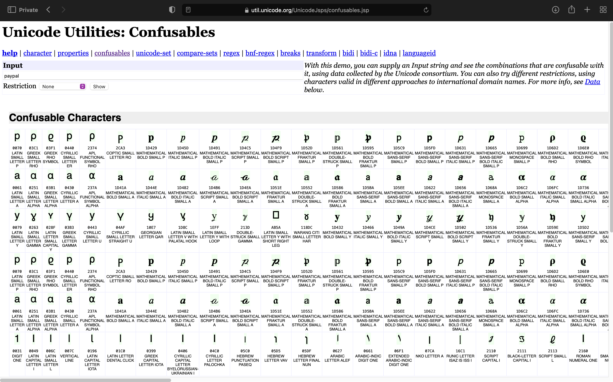
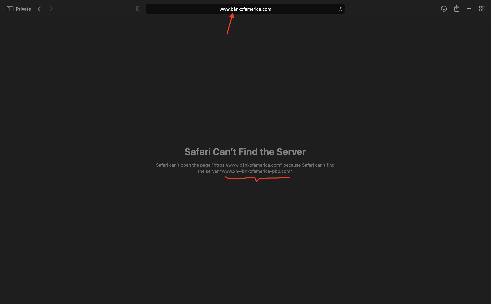
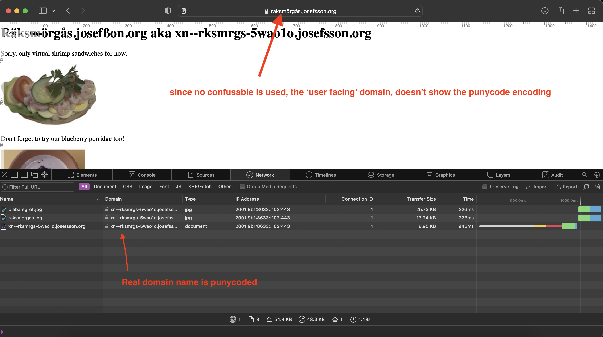

This post is the result of some post-discussion on my [Swift Strings for iOS interviewing](https://mfaani.com/posts/interviewing/string/) post. 

Given that characters look like one another or that are invisible codepoints I thought there might be some room for abuse. Luckily Unicode has great documentation security. At the high level there are two types of security issues:

### Visual Security Issues

> Suppose that the user gets an email notification about an apparent problem in their Citibank account. Security-savvy users realize that it might be a spoof; the HTML email might be presenting the URL http://citibank.com/... visually, but might be hiding the real URL. They realize that even what shows up in the status bar might be a lie, because clever Javascript or ActiveX can work around that. (And users are likely to have these turned on, unless they know to turn them off.) They click on the link, and carefully examine the browser’s address box to make sure that it is actually going to http://citibank.com/.... They see that it is, and use their password. However, what they saw was wrong—it is actually going to a spoof site with a fake “citibank.com”, using the Cyrillic letter that looks precisely like a ‘c’. They use the site without suspecting, and the password ends up compromised.

### Non-visual Security Issues

> For example, suppose that strings containing the letters “delete” are sensitive internally, and that therefore a gatekeeper checks for them. If some process casefolds “DELETE” after the gatekeeper has checked, then the sensitive string can sneak through. While many programmers are aware of this, they may not be aware that the same thing can happen with other transformations, such as an NFKC transformation of “Ⓓⓔⓛⓔⓣⓔ” into “delete”.


The technical term for similar looking characters is [confusables](https://util.unicode.org/UnicodeJsps/confusables.jsp).


One of main places where having knowledge about confusables is domain names.  
What happens if instead of typing `www.google.com`, someone is given a fake URL of `www.gòogle.com`. 
Or what happens if instead of `https://www.bankofamerica.com` someone is given a fake URL of `https://www.bânkofamerica.com`. 

Let's try them: 
   
```
gòogle.com --> (is represented as) xn-gogle-uta.com
```


```
bankofamerica.com --> xn-bnkofamerica-pbb.com
```



### That's weird. Why is the URL changing?

Anytime a _confusable_ is part of the domain name, then the browser will alter the domain name to something else. The end result is a confusing and perhaps ugly domain. Browsers purposely make the domain name ugly, so users are alerted that the URL they used is phony. Upon seeing that the user is more likely to double check things and perhaps not enter credentials for that URL.

Using more technical terms:

> [Browsers](https://en.wikipedia.org/wiki/Web_browser) will typically turn [confusables](https://util.unicode.org/UnicodeJsps/confusables.jsp) into [punycode](https://en.wikipedia.org/wiki/Punycode)

> Punycode is a representation of Unicode with the limited ASCII character subset used for Internet hostnames. Using Punycode, host names containing Unicode characters are transcoded to a subset of ASCII consisting of letters, digits, and hyphens, which is called the letter–digit–hyphen (LDH) subset. For example, `München` (German name for Munich) is encoded as `Mnchen-3ya`.

tldr Punycode is a domain name with non-ascii code turned into ascii code. 

### Is every character with diacritics a confusable? 

No! If you just tried `münchen.com`, you won't see it changed in the address bar of your browser. 
It won't get prefixed with `xn` because `ü` is NOT considered a confusable. 

### When do domain names get punycode encoding?
Any time they contain non-ASCII characters.
### Will we always _see_ the punycode encoding?

Punycode encoding may happen without you seeing it. Safari makes a distinction between the "real domain name", used for DNS requests and such, and the "user-visible" domain name, which is used in the address field, status bar, etc.

The real domain name is always converted to punycode, the "user-visible" one is **only converted when needed for security** i.e. it's converted if confusable characters were used. 

### Can you share an example of punycode encoding that doesn't have security concerns?
This is the case for most non-english domain names. 
They may use non-latin characters (Hebrew, Arabic, Chinese, etc) or use latin-based characters (French, German, Italian, etc).

Surprisingly I'm having a hard time finding actual domains names that use non-ascii pattern. As one example: räksmörgås.josefsson.org 

But for more see [Internationalized domain name
](https://en.wikipedia.org/wiki/Internationalized_domain_name). 

https://github.com/WebKit/WebKit/blob/main/Source/WTF/wtf/URLHelpers.cpp#L833 – this is where it computes the user-visible form of the URL. The checks for whether the host name contains lookalike characters are within `allCharactersInAllowedIDNScriptList`. It looks like it prohibits some Unicode scripts entirely, and also prohibits individual lookalike characters.
### So can we have non-English URLs?
Yes. But they get mapped. Because **all** DNS lookups for domain names, is restricted to use ASCII. 
Examples:


| domain name | real domain name (used for DNS) | user visible domain (what users see) | 
| ----------- | ------------------------------- | ------------------------------------ | 
| apple.com (all characters are ascii) | apple.com | apple.com | 
| tòp.com (non-ascii are used. But they're confusables) | xn--tp-2ja.com | xn--tp-2ja.com  |
| räksmörgås.josefsson.org (non-ascii are used. But they're not confusable) |  xn--rksmrgs-5wao1o.josefsson.org | räksmörgås.josefsson.org | non-confusables characters are used |



To see the resolved URL, you can use the browser's console. Networking. 



### What's the difference between URL and domain name? 
URL: `https://www.arsenal.com/history`  
Protocol: `https://`  
Domain name: `arsenal.com`  
path: `/history`

The application of punycode is solely for the domain name. Not other elements of the URL


### Acknowledgements 

Major shout out to [Mark Rowe](https://twitter.com/bdash) who answered all my questions so I can put together this post. 

### Other References
- Must see: [Internationalized Domain Names (IDN) FAQ](https://unicode.org/faq/idn.html)
- [Internationalized domain name - wiki](https://en.wikipedia.org/wiki/Internationalized_domain_name)