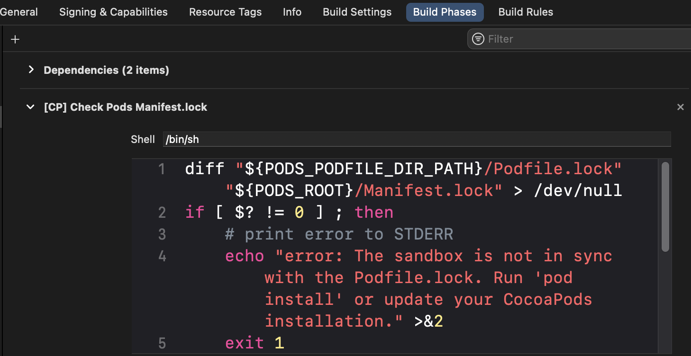

When you get on a plane, the crew members make sure everyone that checked in, is actually on the flight. If someone doesn't board, then the plane either stays until they board or remove them and their luggages from the plane. It's a safety check. 

CocoaPods does something similar. But before we dive deep into what a `Manifest.lock` file is, we should learn about the two school of thoughts when it comes to dependencies. 

## Committing /Pods folder
Commit the `Podfile`, `Podfile.lock` and `/Pods` folder. 

**Pros:** Anyone can download the project and even without having CocoaPods they can run the app. It's easier to see all the code at once. They'll only need to have CocoaPods installed if they ever needed to bump a pod version. 

**Cons:** Your repo size would go up, because it contains all these libraries. 

#### When is `pod install` required?
- If you bumped a pod version. The intent is to propagate the changes to both the `Podfile.lock` and `/Pods` 

## Not committing the /Pods folder
Commit the `Podfile`, `Podfilee.lock` only. Don't commit the `/Pods` folder.

**Pros:** Your repo size is smaller. 

**Cons:** Every person needs to have CocoaPods installed. And before they do anything, they have to do `pod install` to make sure they have all the necessary code pulled in. It's a tedious and repetitive process as everyone in your team has to do it. The extra process also makes it slightly more difficult for junior engineers to learn about the project. 

#### When is `pod install` required?
- After you clone the repo.
- If you bumped a pod version and want to update the `Podfile.lock` so _everyone else_ gets those exact updates.
- After you pulled down the repo and see changes in the `Podfile.lock` and need pull the current version of all dependencies.
----

To be clear, this post isn't about which approach is better. It's just about explaining the differences. For more on the comparsion of the two approaches, see [CocoaPods and Lockfiles - video](https://www.youtube.com/watch?v=H-zK1mEwTe0)

You might be thinking now how do we make sure everyone has all the correct pods installed. It's simple, the `Podfile.lock` gives you the version used for every pod. Think of the `Podfile.lock` as a snapshot of all your versions. 

## So when does the `Manifest.lock` come into play? 

It's mainly used to protect you when your intent is 'After you pulled down the repo and see changes in the `Podfile.lock` and need to match your latest snapshot'. 

- The `Podfile.lock` is your _repo's_ snapshot.
- The `Manifest.lock` is your _local_ machine's snapshot. 

If these two files don't match, then Xcode will throw a build time error. 

To be clear those two files always have to always match, it's just that there's a higher probability of things not matching when 2 engineers/macs are involved. Meaning one engineer has done `pod install` on their mac and has updated the `Podfile.lock` and now you have to do another `pod install` on your own mac. When you run `pod install` on your mac, it affects your `Manifest.lock`. 

## How does Xcode check your lock files?

Xcode adds a shell script into the Build Phases.

If the lock files don't match, then Xcode will throw the following error: 

> error: The sandbox is not in sync with the `Podfile.lock`. Run 'pod install' or update your CocoaPods installation.

## Docs: 

To show [CocoaPods docs](https://github.com/CocoaPods/CocoaPods/blob/master/lib/cocoapods/installer.rb#L21-L25) on this: 

>  `Manifest.lock`: A file contained in the Pods folder that keeps track of
>  the pods installed in the local machine. This files is used once the
>  exact versions of the Pods has been computed to detect if that version
>  is already installed. This file is not intended to be kept under source
>  control and is a copy of the `Podfile.lock`.

## Summary

- `Manifest.lock` is per machine, while `Podfile.lock` is per project. 
- `Manifest.lock` should never be commited, while `Podfile.lock` must always be committed. 
- `Manifest.lock` should always match the `Podfile.lock`. Otherwise you'll get a build error.
- Committing the /Pods folder depends on your team's decision. It's optional. 