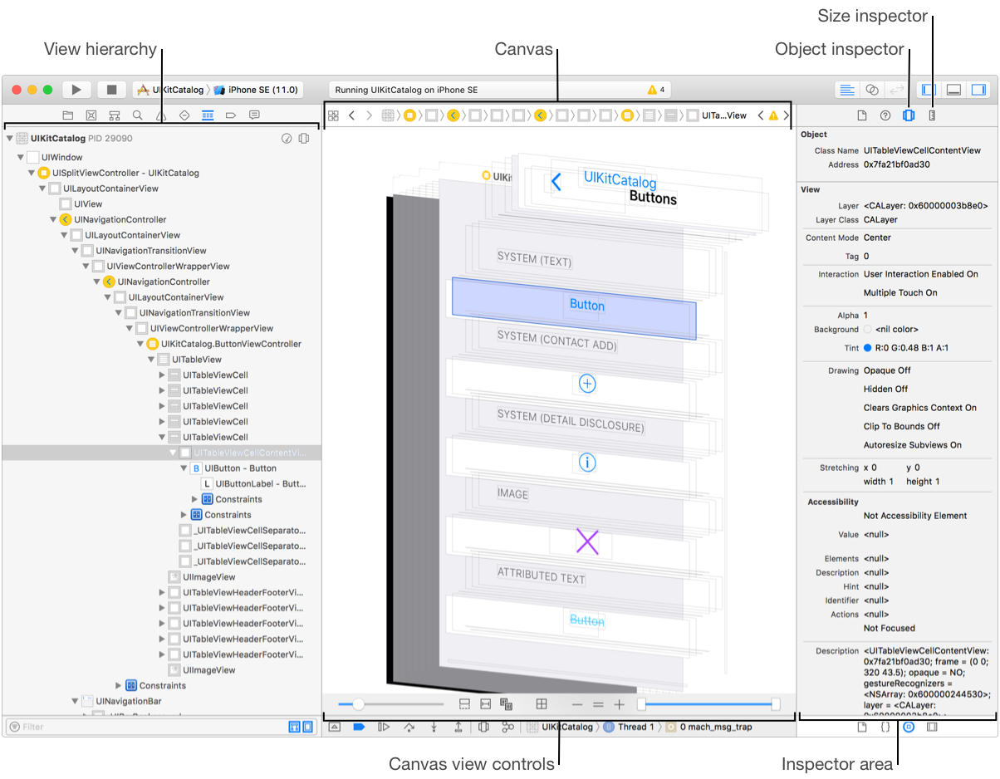
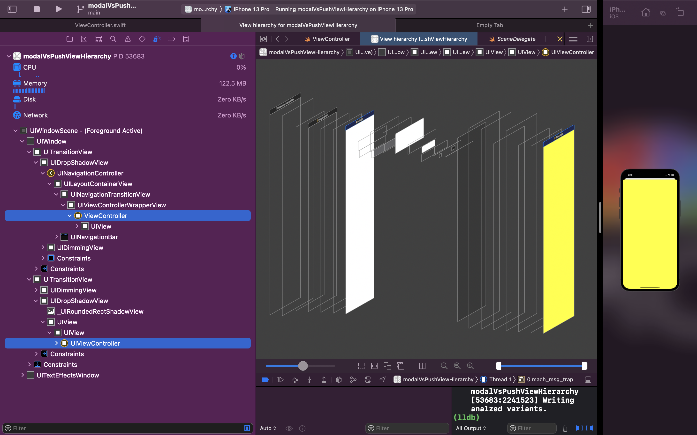

I was using Xcode's View Hierarchy and noticed this `UITransitionView` in my hierachy. 

```
...
    UIWindow
        UITransitionView
            FooVC
        UITransitionView
            BarVC
```

What made it more perplexing was that the cavnas was showing things correct, but the _View Hierachy_ didn't make sense.

To be clear on jargon, the following is the name of each section of Apple's view debugger:




I googled Apple documents, but found notihing on `UITransitionView`. It's private API. 
I had suspicions about what it was... So I opened up a sample project to test things out. 

The following is the view hierachy I got for **presenting** the yellow VC on another VC. 


Expanded Hierarchy is as such: 




## Conclusion

If you you're seeing `UITransitionView` it's likely because you're **presenting** one viewcontroller over another.
