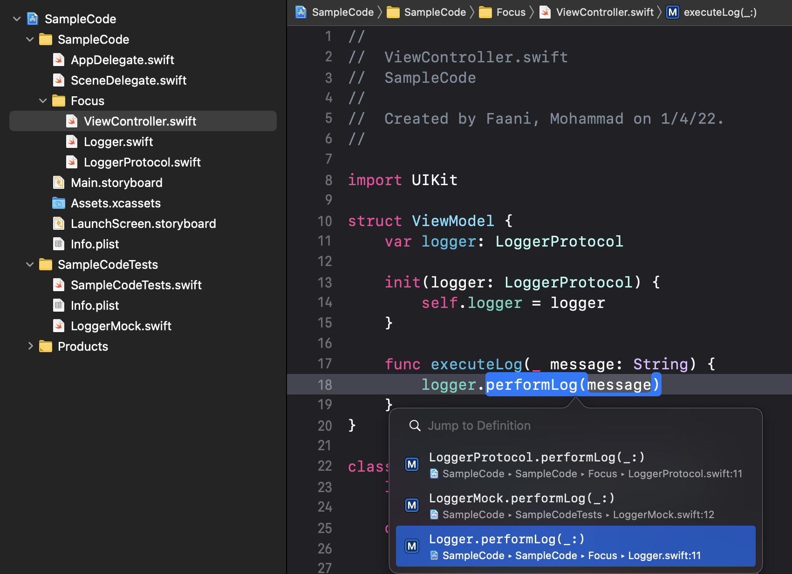

Download the [sample project](https://github.com/prohoney/xcode-cant-show-caller-sample) if you want. You don't have to though.
The project doesn't even need to be ran. It's just provided for context. 

I'm going to discuss two gotchas I hade with Xcode. For quite some time (~65 months) I thought a fix was coming, then I realized this is because I didn't fully understand the difference between an interface (or protocol) with a concrete type. 

### Find Call Hierarchy not working:

Have you ever right clicked on a function -> Find -> Find Call Hierarchy, but then wondered why Xcode doesn't show you where the function is getting called from? 


The reason that such a complication exists is Swift Protocols. The compiler is very precise. 

- When you try to look up 'Find Call Hierarchy' on a **concrete type**, Xcode tries to look things up by finding a call to that very implementations. 
- When you try to look up 'Find Call Hierarchy' on a **protocol type**, Xcode tries to look things up by finding a call to all conforming implementations. 


```swift
class Logger: LoggerProtocol {
    func performLog() {
        print("Production Code")
    }
}
```

Trying to find all callers of `performLog` from above results in Xcode looking up _references_ for `Logger.performLog`. Usually there aren't much callers that directly hit a concrete implemenation of a function. Xcode found zero callers!


While for: 

```swift
protocol LoggerProtocol {
    func performLog()
}
```

As a result I often end up doing: 'Find call hierarchy' on the protocol function and and then 

Trying to find all callers of `performLog` from above results in Xcode looking up _references_ for `LoggerProtocol.performLog`. Usually there are a lot of conforming types that implement a function.  Xcode found 1 caller:


### Jump to Definition not working:

Similarly, have you ever right clicked on a function call -> Jump to Definition -> Then get prompted with too many definitions?


When it comes to protocols, the compiler just can't tell _which_ adaptation of a protocol gets used e.g. upon tapping 'Jump to Definition' on `performLog` in the snippet below, Xcode will show all conformances (production adoption, test-code adoption, another production adoption, etc.) to that _protocol_ requirement.

```swift
struct ViewModel {
    var logger: LoggerProtocol
    
    func executeLog() {
        logger.performLog()
    }
}
```

Xcode leaves it up to you to decide _which_ class definition/implementation is the one you're looking for. 



Usually you don't want the protocol definition nor want the mock implementation. Rather you just want one of the concrete implementations that is for production code.

## Conclusion: 

Xcode can't automagically identify which implementation of a protocol is used. Additionally when a _concrete_ type is never made part of the contract/API/signature, then it won't be used in Xcode's lookups that happen against the _protocol_ type. Using this insight we can better understand the behavior of Xcode and use its tools in the right way. 
