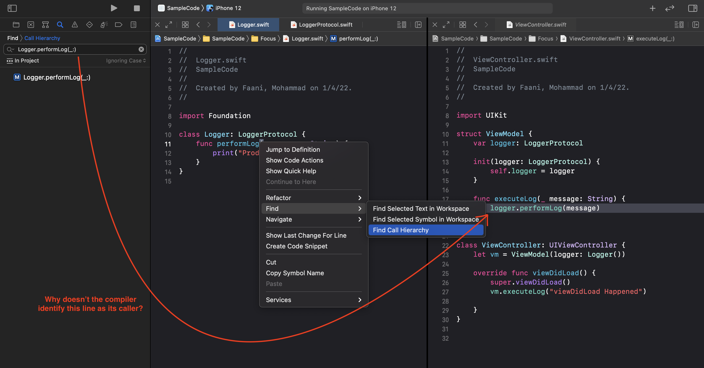
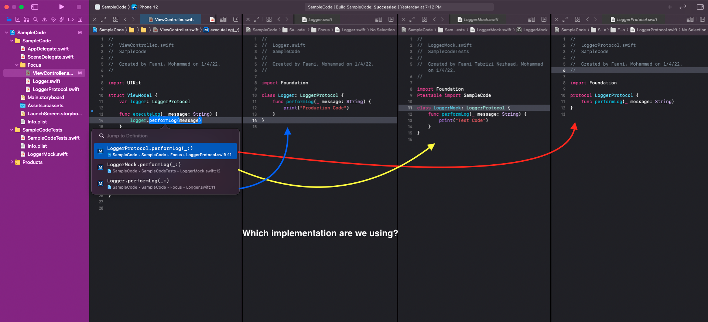
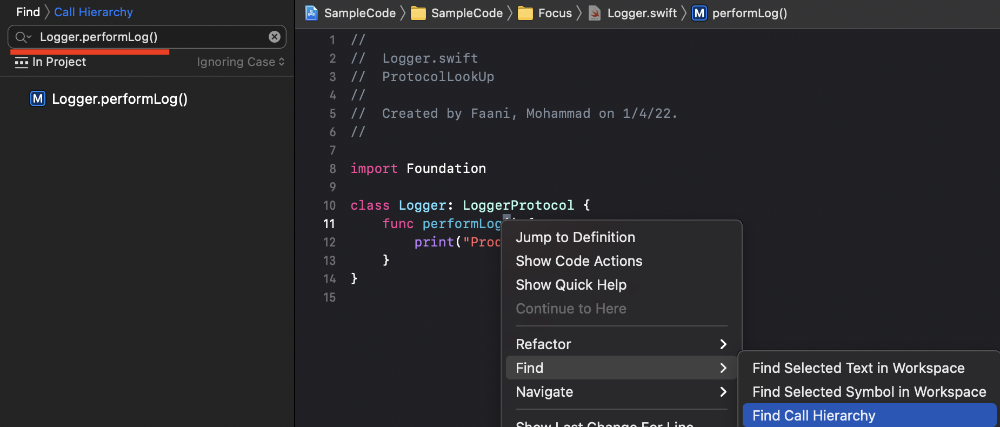
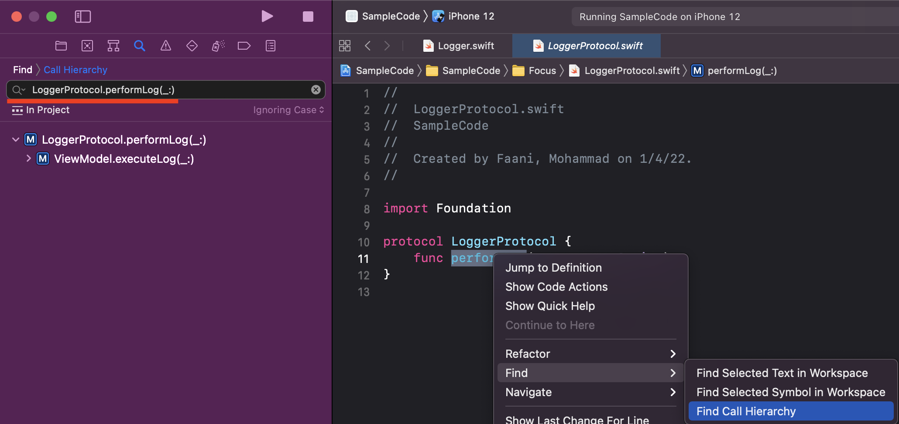

Please download the sample project. 
There's no function of the project that needs to be ran. Just focus on the protocol definition and conformances to it. 

I'm going to discuss two gotchas with protocols and Xcode.  

1. Have you ever right clicked on a function -> Find -> Find Call Hierarchy, but then wondered why Xcode doesn't show you where the function is getting called from? 




2. Or ever right clicked on a function call -> Jump to Definition -> Then get prompted with too many definitions?



The reason for such complications exist are Swift Protocols. The compiler is very precise. 

- When you try to look up 'Find Call Hierarchy' on a **concrete type**, Xcode tries to look things up by finding a call to that very implementations. 
- When you try to look up 'Find Call Hierarchy' on a **protocol type**, Xcode tries to look things up by finding a call to all conforming implementations. 


```swift
class Logger: LoggerProtocol {
    func performLog() {
        print("Production Code")
    }
}
```

Trying to find all callers of `performLog` from above results in Xcode looking up _references_ for `Logger.performLog`. Usually there aren't much callers that hit directly a concrete implemenation of a function. Xcode found zero callers!



While for: 

```swift
protocol LoggerProtocol {
    func performLog()
}
```

Trying to find all callers of `performLog` from above results in Xcode looking up _references_ for `LoggerProtocol.performLog`. Usually there are a lot of conforming types that implement a function.  Xcode found 1 caller:




As for the other issue i.e. 'Jump to Definition', when it comes to protocols, the compiler just can't tell _which_ adaptation of a protocol gets used e.g. upon tapping 'Jump to Definition' on `performLog` in the snippet below, Xcode will show all conformances (production adoption, test-code adoption, another production adoption, etc.) to that _protocol_ requirement.

```swift
struct ViewModel {
    var logger: LoggerProtocol
    
    func executeLog() {
        logger.performLog()
    }
}
```

## Conclusion: 

Xcode can't automagically identify which implementation of a protocol is used. Additionally when a _concrete_ type is never made part of the contract/API/signature, then it won't be used in Xcode's lookups that happen against the _protocol_ type.